# SaveBuddy UI/UX Audit & Comprehensive Redesign Plan

> **Document Version:** 2.0  
> **Target Audience:** Consumer / Personal Finance End-Users  
> **Design Philosophy:** Modern, Trustworthy, Calm, Simple, Premium, Friendly, Human, Finance-Focused  
> **Constraint:** Retain 100% of existing functional modules, APIs, database models, and business logic. Reorganize and elevate the user interface exclusively around the user's financial life.

---

## 1. Executive Summary of Current Problems

### 1.1 The "Engineering Dashboard" Syndrome
The initial implementation prioritized functional correctness across Modules 1 through 8. While all business logic, APIs, and models perform flawlessly (61/61 automated tests passing), the user-facing presentation was structured around technical engineering milestones:
- The public root (`/`) rendered a **System Health & Architecture** dashboard prominently declaring *"Module 1 — Foundation & Environment"*, *"REST API — UP"*, *"DATABASE — CONNECTED"*, and *"LATENCY — 22 ms"*.
- The global navigation bar featured a permanent *"System Health"* link and an engineering status indicator pill.
- Goal categories, status pills, and error envelopes were styled with developer terminology rather than empathetic personal finance language.

### 1.2 Core Product Identity
- **Product Name:** SaveBuddy
- **Tagline:** Finance & Savings
- **Core Value Proposition:** Empower individuals and groups to understand their cash flow, set purposeful savings targets, track transparent contributions, and leverage Google Gemini AI for realistic, disciplined milestone roadmaps.

---

## 2. Page-by-Page Comprehensive Audit

```
┌────────────────────────────────────────────────────────────────────────────────────────┐
│                                 PAGE AUDIT INVENTORY                                   │
├────┬─────────────────────────────┬───────────────────────────┬─────────────────────────┤
│ #  │ Route                       │ Current Nature            │ Redesigned Nature       │
├────┼─────────────────────────────┼───────────────────────────┼─────────────────────────┤
│ 1  │ /                           │ Developer Health Console  │ Consumer Landing Page   │
│ 2  │ /dashboard                  │ Basic Aggregation Widget  │ Full Financial Cockpit  │
│ 3  │ /transactions               │ Non-existent              │ Unified Cash Flow Ledger│
│ 4  │ /goals                      │ Technical Goals List      │ Purposeful Goals Hub    │
│ 5  │ /goals/:id                  │ Multi-block Technical View│ Luxury Goal Detail Page │
│ 6  │ /group-goals                │ Basic Shared Goals List   │ Social Savings Pools    │
│ 7  │ /group-goals/:id            │ Ledger + Table View       │ Transparent Group Hub   │
│ 8  │ /ai-planner                 │ Embedded in Goal Detail   │ Dedicated AI Planner    │
│ 9  │ /profile                    │ Sparse Form Fields        │ Financial Profile & Set.│
│ 10 │ /login & /register          │ Basic Auth Screens        │ Polished Fintech Onboard│
│ 11 │ /dev/system-health          │ Public root (exposed)     │ Developer-Only Route    │
└────┴─────────────────────────────┴───────────────────────────┴─────────────────────────┘
```

---

### Audit 1: Public Root (`/`)
- **Current Purpose:** Renders `HealthCheckPage.jsx` testing REST API, MongoDB connection, ping latency, and 404 test buttons.
- **Current Problems:** Completely inappropriate for consumers. Presents the app as a backend diagnostic utility rather than a fintech product.
- **New User-Facing Purpose:** A welcoming, elegant Consumer Landing Page showcasing:
  - Hero Section: *"Turn Your Financial Plans Into Effortless Progress"* with clear CTAs (*"Start Saving Today"* and *"Sign In"*).
  - Feature Pillars: AI Smart Pacing, Collaborative Group Pools, Transparent Ledgers, and Milestone Tracking.
  - Social Proof / Value Props: Trustworthy, bank-grade encryption, empathetic guidance.
  - Dynamic Routing: If user is authenticated, automatically redirects to `/dashboard`.
- **Components to Retain:** Underlying health check API is preserved for `/dev/system-health`.
- **Components to Redesign / Create:** `LandingPage.jsx`, consumer hero, feature cards, fintech testimonials.
- **API / Data Source:** None required for public static landing; checks `AuthContext.isAuthenticated` for redirect.
- **Responsive Requirements:** Mobile-first hero layout with sticky mobile action buttons.

---

### Audit 2: Dashboard (`/dashboard`)
- **Current Purpose:** Renders high-level summary cards (Total Saved, Target, Progress, Active Goals) and an urgent goals countdown list.
- **Current Problems:**
  - Does not answer fundamental cash flow questions: *"How much did I earn?"*, *"How much did I spend?"*, *"How much can I save?"*.
  - Missing recent transaction activity feed.
  - Cards look like administrative system tiles rather than a financial summary.
- **New User-Facing Purpose:** The central financial cockpit answering:
  - *"How much did I earn & spend this month?"* $\rightarrow$ Monthly Income, Expenses, Available to Save, and Savings Rate % widgets.
  - *"What are my active goals?"* $\rightarrow$ Visual goal progress cards with remaining days and progress rings.
  - *"Am I on track?"* $\rightarrow$ Gemini AI Smart Savings insight banner with quick recommendations.
  - *"What needs my attention?"* $\rightarrow$ Top 3 approaching deadlines.
  - *"Quick Actions"* $\rightarrow$ `+ Log Contribution`, `+ Add Income/Expense`, `+ New Goal`.
- **Components to Retain:** `fetchDashboardSummary` API client, `UrgentGoalsList` (redesigned), `ProgressBar`.
- **Components to Redesign:** `DashboardPage.jsx`, `StatCard.jsx` (elevate to luxury cash flow widgets), `RecentActivityFeed.jsx`.
- **API / Data Source:** `GET /api/dashboard/summary`, `GET /api/goals`, `User` profile monthly income/expense metrics.
- **Responsive Requirements:** Multi-column grid on desktop (3:1 ratio for overview vs. insights); single-column card stack on mobile.

---

### Audit 3: Transactions Page (`/transactions`)
- **Current Purpose:** Did not exist as a dedicated page; deposits were only viewable within individual goal pages.
- **Current Problems:** Users could not view their total financial cash flow, compare spending/contributions, or filter transactions across goals.
- **New User-Facing Purpose:** A unified personal-finance transaction ledger:
  - Summary Cards: Total Inflow/Income, Total Outflow/Expenses, Net Savings.
  - Action: `+ Add Transaction` modal (Support Income, Expenses, and Savings Goal Contributions).
  - Filters: Type tabs (`All`, `Income`, `Expenses`, `Contributions`), Category dropdown, Date filter, live Search bar.
  - Transaction List: Date, Description, Category icon, Type pill, Amount with positive (+ green) and negative (- warm charcoal/red) distinctions.
  - Mobile behavior: Transforms desktop table into rich swipeable cards.
- **Components to Create:** `TransactionsPage.jsx`, `TransactionSummaryCards.jsx`, `TransactionTable.jsx`, `AddTransactionModal.jsx`.
- **API / Data Source:** Aggregates user contributions from `GET /api/goals/:id/contributions` across user goals + personal cash flow ledger state.
- **Responsive Requirements:** Data table on screens $> 768\text{px}$, responsive financial cards on screens $< 768\text{px}$.

---

### Audit 4: Savings Goals Page (`/goals`)
- **Current Purpose:** Grid of personal savings goals with search and status tabs.
- **Current Problems:**
  - Visual cards lack emotional resonance and delight.
  - Missing monthly pace indicators (`₹X/month required`).
  - Categories look technical rather than lifestyle-oriented.
- **New User-Facing Purpose:** "My Savings Goals — Turn your plans into progress."
  - Category icons: 💻 Tech & Gadgets, ✈️ Travel, 🛡️ Emergency, 🎓 Education, 🚗 Vehicle, 🏡 Home, 💖 Lifestyle.
  - Goal Card: Current vs Target balance, progress bar with percentage, remaining sum, target date, required monthly pacing pill (`₹4,200/mo on track`), and quick action buttons (`View Details`, `+ Add Deposit`).
  - Status tabs: `Active Goals`, `Completed Milestones 🎉`, `Archived`.
  - Empty State: Friendly illustration + *"Start with something you're saving for"* + `+ Create Goal` button.
- **Components to Retain:** `GoalFormModal.jsx`, `ProgressBar.jsx`, `api.get('/goals')`.
- **Components to Redesign:** `GoalsPage.jsx`, `GoalCard.jsx` (redesign to luxury card layout).
- **API / Data Source:** `GET /api/goals`, `POST /api/goals`, `DELETE /api/goals/:id`.
- **Responsive Requirements:** 1-column on mobile, 2-column on tablet, 3-column on desktop.

---

### Audit 5: Goal Details Page (`/goals/:id`)
- **Current Purpose:** Shows goal target, contributions ledger, and Gemini AI plan.
- **Current Problems:** Layout is vertically stacked with heavy borders; feels fragmented and administrative.
- **New User-Facing Purpose:** A comprehensive, delightful Goal Hub:
  - Hero Progress Banner: Goal title, category badge, large saved balance vs target, percentage ring, countdown badge, and prominent action buttons (`+ Add Contribution`, `✨ Gemini AI Advice`).
  - Milestone Progression: Step-by-step intermediate checkpoints.
  - Transparent Deposit History: Ledger showing every contribution with contributor name, timestamp, and optional note.
  - Quick Adjustment: Edit goal parameters or archive safely.
- **Components to Retain:** `AddContributionModal.jsx`, `ContributionHistoryList.jsx`, `AIPlanCard.jsx`.
- **Components to Redesign:** `GoalDetailsPage.jsx` layout, progress visualization, action bar.
- **API / Data Source:** `GET /api/goals/:id`, `GET /api/goals/:id/contributions`, `GET /api/goals/:id/ai-plan`.

---

### Audit 6: Group Goals Page (`/group-goals`) & Details (`/group-goals/:id`)
- **Current Purpose:** Collaborative shared goals list and detail page.
- **Current Problems:**
  - Shared goals feel sterile; lacks social warmth and group cohesion.
  - Member breakdown leaderboard needs more visual hierarchy.
- **New User-Facing Purpose:** "Group Goals — Save together. Reach goals together."
  - Group card: Goal title, category, collective progress bar, member avatar stack (e.g. Jainsi, Rahul, Aman, Priya), and member count pill.
  - Group Details:
    - Shared pool progress meter and total group target.
    - Member Contribution Leaderboard (`MemberContributionChart.jsx`) with proportional shares and ranked contributions.
    - Member Roster (`GroupMemberBadge.jsx`) showing roles (Owner vs Member) with owner invite capability.
    - Real-time group activity feed of all member deposits.
- **Components to Retain:** `AddMemberModal.jsx`, `GroupMemberBadge.jsx`, `MemberContributionChart.jsx`.
- **Components to Redesign:** `GroupGoalsPage.jsx`, `GroupGoalDetailsPage.jsx`.
- **API / Data Source:** `GET /api/group-goals`, `GET /api/group-goals/:id`, `GET /api/group-goals/:id/breakdown`, `POST /api/group-goals/:id/members`.

---

### Audit 7: AI Savings Planner (`/ai-planner`)
- **Current Purpose:** Was previously only an embedded widget in `GoalDetailsPage`.
- **Current Problems:** Users had no dedicated place to explore AI-guided financial pacing across all their goals simultaneously.
- **New User-Facing Purpose:** "AI Savings Planner — Personalized, mathematically disciplined roadmaps."
  - Overview of all active goals with their current savings pace.
  - Goal selector: Choose any goal to generate or review a tailored plan.
  - Output presentation:
    - Weekly & Monthly pacing pills (`Save ₹1,875 / week or ₹7,500 / month`).
    - Feasibility rating: `Very Realistic`, `Realistic`, `Challenging`, `Very Challenging`.
    - Month-by-month milestone timeline leading to the target date.
    - Actionable financial tips & habit suggestions.
    - Non-fiduciary financial disclaimer banner.
- **Components to Retain:** `AIPlanCard.jsx`, `MilestoneTimeline.jsx`, `geminiService.js`.
- **Components to Create:** `AIPlannerPage.jsx` (dedicated central AI planning experience).
- **API / Data Source:** `GET /api/goals`, `POST /api/goals/:id/ai-plan`, `GET /api/goals/:id/ai-plan`.

---

### Audit 8: User Profile & Preferences (`/profile`)
- **Current Purpose:** Basic form updating monthly income and currency preference.
- **Current Problems:** Lacks visual polish; missing profile identity, financial health overview, and account security shortcuts.
- **New User-Facing Purpose:** Clean, consumer-grade Profile & Settings:
  - Personal Information: Name, email, join date, member avatar.
  - Financial Profile: Monthly income, monthly budget, preferred currency (INR ₹, USD $, EUR €, GBP £).
  - Savings Strategy: Custom constraints note for Gemini AI tailoring.
  - Security & Session: Password change section, active session info, clean logout.
  - Pure user settings: Zero technical noise (no JWT secrets, no database parameters).
- **Components to Redesign:** `ProfilePage.jsx`.
- **API / Data Source:** `GET /api/auth/me`, `PUT /api/auth/profile`.

---

### Audit 9: Header & Navigation (`Header.jsx`)
- **Current Purpose:** Sticky header.
- **Current Problems:** Contains "System Health" navigation link and displays `HealthStatusBadge` ("API Online") directly to regular users.
- **New User-Facing Purpose:** Modern fintech navigation bar:
  - Logo & Brand: SaveBuddy emblem + "Finance & Savings" tagline.
  - Navigation:
    - **Dashboard**
    - **Transactions**
    - **Goals**
    - **Group Goals**
    - **AI Planner**
  - Right Actions:
    - **NotificationBell** (interactive unread count and popover)
    - **User Profile avatar & name**
    - **Logout button**
  - Developer Link: Relocated to footer or direct URL `/dev/system-health`. No technical status pills in user header.
- **Components to Redesign:** `Header.jsx`, `NotificationBell.jsx`.

---

## 3. Information Architecture (Final Layout)

```mermaid
graph TD
    Public[Public Routes] --> Landing["/ (LandingPage)"]
    Public --> Login["/login"]
    Public --> Register["/register"]

    Auth[Authenticated Routes] --> Dashboard["/dashboard (Main Financial Cockpit)"]
    Auth --> Transactions["/transactions (Inflows, Outflows & Ledger)"]
    Auth --> Goals["/goals (Personal Savings Goals)"]
    Auth --> GoalDetail["/goals/:id (Goal Progress & History)"]
    Auth --> GroupGoals["/group-goals (Collaborative Pools)"]
    Auth --> GroupDetail["/group-goals/:id (Shared Pool & Leaderboard)"]
    Auth --> AIPlanner["/ai-planner (Dedicated Gemini Planner)"]
    Auth --> Profile["/profile (Account & Preferences)"]

    Dev[Developer Routes] --> DevHealth["/dev/system-health (Internal Diagnostics)"]
```



---

## 4. Visual Design System & Tokens

### 4.1 Color Palette
- **Canvas / Background:** `#FBF9F6` (Warm Luxury Off-White / Alabaster)
- **Card Surfaces:** `#FFFFFF` (Pure Crisp White with subtle 1px border `#EAE2D8`)
- **Primary Text:** `#241813` (Deep Espresso)
- **Secondary / Body Text:** `#6E5A4E` (Muted Warm Taupe)
- **Brand Accent:** `#7D5A44` to `#5A3E2D` (Artisan Roasted Coffee gradient)
- **Financial Inflow / Success:** `#1E7E52` / `#ECFDF5` (Subtle Emerald Mint)
- **Financial Outflow / Expenses:** `#B91C1C` / `#FEF2F2` (Warm Terracotta / Rose)
- **Warning / Deadline:** `#B45309` / `#FFFBEB` (Warm Caramel / Amber)

### 4.2 Typography & Hierarchy
- **Brand & Section Headings:** Playfair Display / Serif font (`font-serif`, font-medium, tracking-tight).
- **UI Controls, Numerics & Body:** Modern clean Sans-Serif (Inter / system-ui, font-semibold for numbers, text-sm for labels).
- **Prohibitions:** No ALL-CAPS body text, no engineering acronyms ("EC-1.5", "MODULE 1"), no raw JSON error printouts.

---

## 5. Implementation Roadmap (Phased Plan)

```text
PHASE 1: Information Architecture & Developer Route Isolation
  - Create dedicated public LandingPage at '/' with automatic redirect to '/dashboard' for logged-in users.
  - Move HealthCheckPage to developer route '/dev/system-health'.
  - Update Header.jsx: Remove "System Health" & "API Status" pills; add "Dashboard", "Transactions", "Goals", "Group Goals", "AI Planner".

PHASE 2: Financial Dashboard & Cash Flow Integration
  - Redesign DashboardPage with monthly income, expenses, available to save, and savings rate.
  - Implement active goal progress cards, urgent deadlines widget, and AI advice highlight card.

PHASE 3: Unified Transactions Ledger
  - Create TransactionsPage at '/transactions' with summary cards (Income, Expenses, Net Savings).
  - Implement transaction filtering (All, Income, Expenses, Contributions), search, and mobile-friendly card layout.
  - Add '+ Add Transaction' modal.

PHASE 4: Goals & Collaborative Group Hubs
  - Redesign GoalsPage & GoalCard with purposeful categories and monthly pace required pills.
  - Polish GoalDetailsPage with unified progress ring, milestone progression, and clean action bars.
  - Redesign GroupGoalsPage & GroupGoalDetailsPage with member avatar stacks and social warmth.

PHASE 5: Dedicated AI Savings Planner
  - Create AIPlannerPage at '/ai-planner' enabling users to select goals, analyze pacing, and visualize monthly milestone cadence.
  - Ensure prominent non-fiduciary disclaimers.

PHASE 6: Profile, Auth & Global Polish
  - Polish ProfilePage, LoginPage, and RegisterPage to match the modern fintech standard.
  - Test responsive behavior across Desktop, Tablet, and Mobile.
  - Run full test suite & production Vite build.
```
