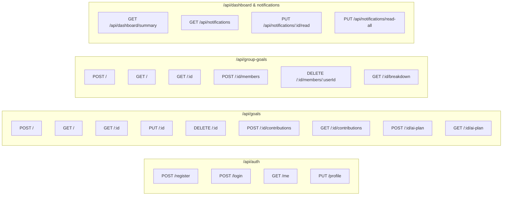

# SaveBuddy — Complete REST API Specification

> **Project ID:** FIN-10  
> **Application:** SaveBuddy (Savings Goal Tracker)  
> **Protocol:** HTTPS / RESTful JSON  
> **Base URL:** `http://localhost:5000/api` (Development) / `https://api.savebuddy.com/api` (Production)  
> **Authentication:** Bearer Token via HTTP `Authorization` Header  
> **Version Baseline:** 1.0 (October 2026)  
> **Reference:** SRS v1.0, `context.md`, `database_design.md`, `edge_cases.md`  

---

## 1. Global Standards & Conventions

### 1.1 Headers
- **Content Negotiation:** `Content-Type: application/json` (Required on all requests with a body).
- **Authentication:** `Authorization: Bearer <JWT_TOKEN>` (Required for all protected endpoints).

### 1.2 Unified Response Envelopes

#### Standard Success Response
```json
{
  "success": true,
  "data": { ... },
  "meta": {
    "timestamp": "2026-10-04T12:00:00.000Z",
    "page": 1,
    "limit": 20,
    "total": 45
  }
}
```

#### Standard Error Response
```json
{
  "success": false,
  "error": {
    "code": "ERROR_CODE_IDENTIFIER",
    "message": "Human-readable explanation of error.",
    "field": "optional_field_name",
    "timestamp": "2026-10-04T12:00:00.000Z"
  }
}
```

### 1.3 Standard HTTP Status Codes

| Code | Status | Usage in SaveBuddy |
| :---: | :--- | :--- |
| **200** | `OK` | Request succeeded; returns data payload. |
| **201** | `Created` | Resource successfully created (Goal, Contribution, User, Member). |
| **204** | `No Content` | Successful deletion or state change with no response body. |
| **400** | `Bad Request` | Validation failure (invalid input, past date, negative number, malformed JSON). |
| **401** | `Unauthorized` | Missing, expired, or invalid JWT authentication token. |
| **403** | `Forbidden` | User lacks permissions (e.g. non-owner attempting goal deletion). |
| **404** | `Not Found` | Target resource does not exist. |
| **409** | `Conflict` | Resource state conflict (e.g. duplicate email, duplicate group member). |
| **422** | `Unprocessable Entity`| Syntactically correct input violates domain invariants. |
| **429** | `Too Many Requests`| Rate limit exceeded (login attempts or Gemini API requests). |
| **500** | `Internal Server Error`| Unhandled server-side error. |
| **503** | `Service Unavailable` | Database down or external Gemini API unreachable. |

---

## 2. API Endpoints Directory



---

## 3. Authentication & Profile Endpoints (`/api/auth`)

### 3.1 Register User
- **Method / Path:** `POST /api/auth/register`
- **Access:** Public
- **Description:** Registers a new individual user account and issues a signed JWT token.

#### Request Body
```json
{
  "name": "Jane Doe",
  "email": "jane.doe@example.com",
  "password": "SecurePassword123!",
  "currencyPreference": "INR"
}
```

#### Success Response (`201 Created`)
```json
{
  "success": true,
  "data": {
    "token": "eyJhbGciOiJIUzI1NiIsInR5cCI6IkpXVCJ9...",
    "user": {
      "id": "67000101a1b2c3d4e5f60001",
      "name": "Jane Doe",
      "email": "jane.doe@example.com",
      "currencyPreference": "INR",
      "createdAt": "2026-10-04T12:00:00.000Z"
    }
  }
}
```

#### Error Responses
- **`400 Bad Request`:** Password $< 6$ characters or invalid email format.
- **`409 Conflict`:** Email already registered (`code: "EMAIL_ALREADY_EXISTS"`).

---

### 3.2 Login User
- **Method / Path:** `POST /api/auth/login`
- **Access:** Public (Rate limited: 5 attempts per 15 min)
- **Description:** Authenticates user credentials and issues a signed JWT token.

#### Request Body
```json
{
  "email": "jane.doe@example.com",
  "password": "SecurePassword123!"
}
```

#### Success Response (`200 OK`)
```json
{
  "success": true,
  "data": {
    "token": "eyJhbGciOiJIUzI1NiIsInR5cCI6IkpXVCJ9...",
    "user": {
      "id": "67000101a1b2c3d4e5f60001",
      "name": "Jane Doe",
      "email": "jane.doe@example.com",
      "currencyPreference": "INR"
    }
  }
}
```

#### Error Responses
- **`401 Unauthorized`:** Incorrect email or password (`code: "INVALID_CREDENTIALS"`).
- **`429 Too Many Requests`:** Rate limit exceeded (`code: "AUTH_RATE_LIMITED"`).

---

### 3.3 Get Current User Profile
- **Method / Path:** `GET /api/auth/me`
- **Access:** Protected (Bearer Token)
- **Description:** Returns profile and financial context of the authenticated user.

#### Success Response (`200 OK`)
```json
{
  "success": true,
  "data": {
    "id": "67000101a1b2c3d4e5f60001",
    "name": "Jane Doe",
    "email": "jane.doe@example.com",
    "currencyPreference": "INR",
    "monthlyIncome": 50000,
    "savingsConstraints": "₹15,000 fixed rent per month",
    "createdAt": "2026-10-04T12:00:00.000Z"
  }
}
```

---

### 3.4 Update User Financial Profile
- **Method / Path:** `PUT /api/auth/profile`
- **Access:** Protected (Bearer Token)
- **Description:** Updates optional financial constraints used by Gemini AI advisor.

#### Request Body
```json
{
  "currencyPreference": "INR",
  "monthlyIncome": 55000,
  "savingsConstraints": "₹15,000 rent, ₹5,000 utilities"
}
```

#### Success Response (`200 OK`)
```json
{
  "success": true,
  "data": {
    "id": "67000101a1b2c3d4e5f60001",
    "currencyPreference": "INR",
    "monthlyIncome": 55000,
    "savingsConstraints": "₹15,000 rent, ₹5,000 utilities",
    "updatedAt": "2026-10-04T12:15:00.000Z"
  }
}
```

---

## 4. Savings Goals Endpoints (`/api/goals`)

### 4.1 Create Savings Goal
- **Method / Path:** `POST /api/goals`
- **Access:** Protected (Bearer Token)
- **Description:** Creates a new savings goal with a target amount and future deadline.

#### Request Body
```json
{
  "title": "Emergency Fund",
  "description": "6 months of living expenses reserve",
  "category": "emergency",
  "targetAmount": 60000,
  "deadline": "2027-04-01T23:59:59.000Z",
  "initialContribution": 5000
}
```

#### Success Response (`201 Created`)
```json
{
  "success": true,
  "data": {
    "id": "67000201a1b2c3d4e5f60002",
    "ownerId": "67000101a1b2c3d4e5f60001",
    "title": "Emergency Fund",
    "description": "6 months of living expenses reserve",
    "category": "emergency",
    "targetAmount": 60000,
    "currentAmount": 5000,
    "remainingAmount": 55000,
    "progressPercentage": 8.33,
    "deadline": "2027-04-01T23:59:59.000Z",
    "daysRemaining": 178,
    "status": "active",
    "isGroupGoal": false,
    "createdAt": "2026-10-04T12:00:00.000Z"
  }
}
```

#### Error Responses
- **`400 Bad Request`:** `targetAmount` $\le 0$, deadline in the past, or missing title.

---

### 4.2 List Accessible Goals
- **Method / Path:** `GET /api/goals`
- **Access:** Protected (Bearer Token)
- **Query Parameters:**
  - `status` (optional): `active` | `completed` | `archived` | `all` (default: `active`)
  - `category` (optional): Filter by category enum
  - `page` (optional, default: 1)
  - `limit` (optional, default: 20)

#### Success Response (`200 OK`)
```json
{
  "success": true,
  "data": [
    {
      "id": "67000201a1b2c3d4e5f60002",
      "title": "Emergency Fund",
      "category": "emergency",
      "targetAmount": 60000,
      "currentAmount": 15000,
      "remainingAmount": 45000,
      "progressPercentage": 25.0,
      "deadline": "2027-04-01T23:59:59.000Z",
      "daysRemaining": 178,
      "status": "active",
      "isGroupGoal": false
    }
  ],
  "meta": {
    "page": 1,
    "limit": 20,
    "total": 1
  }
}
```

---

### 4.3 Get Goal Details
- **Method / Path:** `GET /api/goals/:id`
- **Access:** Protected (Owner or Group Member)
- **Description:** Returns detailed goal metrics, remaining savings, and recent activity.

#### Success Response (`200 OK`)
```json
{
  "success": true,
  "data": {
    "id": "67000201a1b2c3d4e5f60002",
    "ownerId": "67000101a1b2c3d4e5f60001",
    "title": "Emergency Fund",
    "description": "6 months of living expenses reserve",
    "category": "emergency",
    "targetAmount": 60000,
    "currentAmount": 15000,
    "remainingAmount": 45000,
    "progressPercentage": 25.0,
    "deadline": "2027-04-01T23:59:59.000Z",
    "daysRemaining": 178,
    "status": "active",
    "isGroupGoal": false,
    "hasAIPlan": true,
    "createdAt": "2026-10-04T12:00:00.000Z"
  }
}
```

#### Error Responses
- **`403 Forbidden`:** User is neither owner nor group member (`code: "ACCESS_DENIED"`).
- **`404 Not Found`:** Goal ID does not exist (`code: "GOAL_NOT_FOUND"`).

---

### 4.4 Update Goal Metadata
- **Method / Path:** `PUT /api/goals/:id`
- **Access:** Protected (Owner only)
- **Description:** Updates title, description, category, target amount, or deadline.

#### Request Body
```json
{
  "title": "Emergency Reserve Fund",
  "targetAmount": 70000,
  "deadline": "2027-05-01T23:59:59.000Z"
}
```

#### Success Response (`200 OK`)
```json
{
  "success": true,
  "data": {
    "id": "67000201a1b2c3d4e5f60002",
    "title": "Emergency Reserve Fund",
    "targetAmount": 70000,
    "currentAmount": 15000,
    "remainingAmount": 55000,
    "progressPercentage": 21.43,
    "status": "active",
    "updatedAt": "2026-10-04T12:20:00.000Z"
  }
}
```

---

### 4.5 Archive / Delete Goal
- **Method / Path:** `DELETE /api/goals/:id`
- **Access:** Protected (Owner only)
- **Description:** Soft-deletes a goal by switching its status to `archived`.

#### Success Response (`200 OK`)
```json
{
  "success": true,
  "message": "Goal successfully archived.",
  "data": {
    "id": "67000201a1b2c3d4e5f60002",
    "status": "archived"
  }
}
```

---

## 5. Contributions Endpoints (`/api/goals/:id/contributions`)

### 5.1 Log a Contribution
- **Method / Path:** `POST /api/goals/:id/contributions`
- **Access:** Protected (Owner or Group Member)
- **Description:** Records an atomic monetary contribution, updates the goal balance, and checks for completion.

#### Request Body
```json
{
  "amount": 2500,
  "date": "2026-10-04T12:00:00.000Z",
  "note": "October salary deposit"
}
```

#### Success Response (`201 Created`)
```json
{
  "success": true,
  "data": {
    "contribution": {
      "id": "67000301a1b2c3d4e5f60003",
      "goalId": "67000201a1b2c3d4e5f60002",
      "userId": "67000101a1b2c3d4e5f60001",
      "amount": 2500,
      "date": "2026-10-04T12:00:00.000Z",
      "note": "October salary deposit"
    },
    "goalSummary": {
      "targetAmount": 60000,
      "currentAmount": 17500,
      "remainingAmount": 42500,
      "progressPercentage": 29.17,
      "status": "active",
      "isCompletedNow": false
    }
  }
}
```

#### Error Responses
- **`400 Bad Request`:** `amount` $\le 0$ or non-numeric (`code: "INVALID_CONTRIBUTION_AMOUNT"`).
- **`400 Bad Request`:** Goal is archived (`code: "CANNOT_CONTRIBUTE_TO_ARCHIVED_GOAL"`).

---

### 5.2 Get Contribution History
- **Method / Path:** `GET /api/goals/:id/contributions`
- **Access:** Protected (Owner or Group Member)
- **Query Parameters:**
  - `page` (default: 1)
  - `limit` (default: 20)

#### Success Response (`200 OK`)
```json
{
  "success": true,
  "data": [
    {
      "id": "67000301a1b2c3d4e5f60003",
      "userId": "67000101a1b2c3d4e5f60001",
      "userName": "Jane Doe",
      "amount": 2500,
      "date": "2026-10-04T12:00:00.000Z",
      "note": "October salary deposit"
    }
  ],
  "meta": {
    "page": 1,
    "limit": 20,
    "total": 1
  }
}
```

---

## 6. Google Gemini AI Savings Advisor (`/api/goals/:id/ai-plan`)

### 6.1 Generate AI Savings Plan
- **Method / Path:** `POST /api/goals/:id/ai-plan`
- **Access:** Protected (Owner or Group Member; Rate limited)
- **Description:** Sends current goal progress, deadline, and optional constraints to Gemini AI to generate an actionable roadmap.

#### Request Body (Optional overrides)
```json
{
  "preferredFrequency": "weekly",
  "additionalNotes": "Will receive a holiday bonus in December"
}
```

#### Success Response (`200 OK`)
```json
{
  "success": true,
  "data": {
    "id": "67000401a1b2c3d4e5f60004",
    "goalId": "67000201a1b2c3d4e5f60002",
    "recommendedWeekly": 1670,
    "recommendedMonthly": 7250,
    "achievabilityScore": "Realistic",
    "milestones": [
      {
        "milestoneName": "Reach 50% Reserve",
        "targetDate": "2026-12-15T00:00:00.000Z",
        "targetAmount": 30000,
        "actionTip": "Deposit part of December bonus"
      },
      {
        "milestoneName": "Final Target Achieved",
        "targetDate": "2027-04-01T00:00:00.000Z",
        "targetAmount": 60000,
        "actionTip": "Maintain ₹1,670 recurring weekly transfer"
      }
    ],
    "practicalRecommendations": [
      "Automate a ₹1,670 transfer to your savings balance every Monday.",
      "Review utility expenses to free up an additional ₹1,000 monthly buffer."
    ],
    "disclaimer": "This plan is an automated estimate for guidance only and does not constitute certified financial advisory.",
    "modelUsed": "gemini-1.5-flash",
    "generatedAt": "2026-10-04T12:25:00.000Z"
  }
}
```

#### Error Responses
- **`400 Bad Request`:** Goal is already completed (`code: "GOAL_ALREADY_COMPLETED"`).
- **`429 Too Many Requests`:** Gemini rate limit exceeded (`code: "AI_RATE_LIMITED"`).
- **`503 Service Unavailable`:** Gemini API unavailable; triggers offline fallback plan.

---

### 6.2 Get Cached AI Plan
- **Method / Path:** `GET /api/goals/:id/ai-plan`
- **Access:** Protected (Owner or Group Member)
- **Description:** Returns the most recently generated AI savings plan without calling the Gemini API.

#### Success Response (`200 OK`)
Returns identical payload to 6.1. If no plan has been generated yet, returns `404 Not Found` (`code: "AI_PLAN_NOT_FOUND"`).

---

## 7. Collaborative Group Goals (`/api/group-goals`)

### 7.1 Create Group Goal
- **Method / Path:** `POST /api/group-goals`
- **Access:** Protected (Bearer Token)
- **Description:** Initializes a shared savings objective and registers the creator as `owner`.

#### Request Body
```json
{
  "title": "Goa Trip 2027",
  "description": "Group fund for flights and villa stay",
  "targetAmount": 50000,
  "deadline": "2027-02-15T23:59:59.000Z",
  "category": "travel",
  "initialMembers": ["rahul.sharma@example.com", "priya.verma@example.com"]
}
```

#### Success Response (`201 Created`)
```json
{
  "success": true,
  "data": {
    "id": "67000501a1b2c3d4e5f60005",
    "title": "Goa Trip 2027",
    "targetAmount": 50000,
    "currentAmount": 0,
    "progressPercentage": 0,
    "deadline": "2027-02-15T23:59:59.000Z",
    "isGroupGoal": true,
    "membersCount": 3,
    "createdAt": "2026-10-04T12:30:00.000Z"
  }
}
```

---

### 7.2 Add Member to Group Goal
- **Method / Path:** `POST /api/group-goals/:id/members`
- **Access:** Protected (Group Owner only)
- **Description:** Adds a registered user to the group by email address.

#### Request Body
```json
{
  "email": "amit.patel@example.com"
}
```

#### Success Response (`201 Created`)
```json
{
  "success": true,
  "message": "Member successfully added to group goal.",
  "data": {
    "userId": "67000601a1b2c3d4e5f60006",
    "name": "Amit Patel",
    "email": "amit.patel@example.com",
    "role": "member",
    "joinedAt": "2026-10-04T12:32:00.000Z"
  }
}
```

#### Error Responses
- **`404 Not Found`:** Email not registered in SaveBuddy (`code: "USER_NOT_FOUND"`).
- **`409 Conflict`:** User is already a member (`code: "MEMBER_ALREADY_EXISTS"`).
- **`403 Forbidden`:** Requesting user is not the group owner (`code: "OWNER_ONLY_ACTION"`).

---

### 7.3 Remove Member or Leave Group
- **Method / Path:** `DELETE /api/group-goals/:id/members/:userId`
- **Access:** Protected (Group Owner or Self)
- **Description:** Removes a member from the group. If the member is the owner, they must first transfer ownership.

#### Success Response (`200 OK`)
```json
{
  "success": true,
  "message": "Member successfully removed from group."
}
```

---

### 7.4 Get Member Contribution Breakdown
- **Method / Path:** `GET /api/group-goals/:id/breakdown`
- **Access:** Protected (Any Group Member)
- **Description:** Aggregates individual contributions and computes percentage shares for every group member.

#### Success Response (`200 OK`)
```json
{
  "success": true,
  "data": {
    "goalId": "67000501a1b2c3d4e5f60005",
    "targetAmount": 50000,
    "currentAmount": 30000,
    "totalProgress": 60.0,
    "members": [
      {
        "userId": "67000101a1b2c3d4e5f60001",
        "name": "Jane Doe",
        "role": "owner",
        "totalContributed": 15000,
        "percentageOfTarget": 30.0,
        "percentageOfTotalSaved": 50.0,
        "contributionCount": 3
      },
      {
        "userId": "67000601a1b2c3d4e5f60006",
        "name": "Amit Patel",
        "role": "member",
        "totalContributed": 15000,
        "percentageOfTarget": 30.0,
        "percentageOfTotalSaved": 50.0,
        "contributionCount": 2
      },
      {
        "userId": "67000701a1b2c3d4e5f60007",
        "name": "Rahul Sharma",
        "role": "member",
        "totalContributed": 0,
        "percentageOfTarget": 0.0,
        "percentageOfTotalSaved": 0.0,
        "contributionCount": 0
      }
    ]
  }
}
```

---

## 8. Dashboard & Notifications Endpoints

### 8.1 Get Dashboard Summary Metrics
- **Method / Path:** `GET /api/dashboard/summary`
- **Access:** Protected (Bearer Token)
- **Description:** Returns high-level summary cards, urgent goals, and milestone status.

#### Success Response (`200 OK`)
```json
{
  "success": true,
  "data": {
    "totalSaved": 47500,
    "totalTarget": 110000,
    "overallProgress": 43.18,
    "activeGoalsCount": 2,
    "completedGoalsCount": 1,
    "urgentGoals": [
      {
        "id": "67000501a1b2c3d4e5f60005",
        "title": "Goa Trip 2027",
        "targetAmount": 50000,
        "currentAmount": 30000,
        "deadline": "2026-10-18T23:59:59.000Z",
        "daysRemaining": 14,
        "category": "travel"
      }
    ]
  }
}
```

---

### 8.2 List Notifications
- **Method / Path:** `GET /api/notifications`
- **Access:** Protected (Bearer Token)
- **Query Parameters:** `unreadOnly` (boolean, default: false)

#### Success Response (`200 OK`)
```json
{
  "success": true,
  "data": [
    {
      "id": "67000801a1b2c3d4e5f60008",
      "type": "goal_completed",
      "title": "Goal Achieved! 🎉",
      "message": "Congratulations! You reached your target for 'Emergency Fund'.",
      "isRead": false,
      "createdAt": "2026-10-04T12:35:00.000Z"
    }
  ],
  "meta": {
    "unreadCount": 1
  }
}
```

---

### 8.3 Mark Notification as Read
- **Method / Path:** `PUT /api/notifications/:id/read`
- **Access:** Protected (Bearer Token)

#### Success Response (`200 OK`)
```json
{
  "success": true,
  "message": "Notification marked as read."
}
```

---

### 8.4 Mark All Notifications as Read
- **Method / Path:** `PUT /api/notifications/read-all`
- **Access:** Protected (Bearer Token)

#### Success Response (`200 OK`)
```json
{
  "success": true,
  "data": {
    "updatedCount": 4
  }
}
```

---

## 9. System & Health Endpoint (`/api/health`)

### 9.1 Health Check
- **Method / Path:** `GET /api/health`
- **Access:** Public
- **Description:** Verifies server responsiveness and MongoDB connectivity.

#### Success Response (`200 OK`)
```json
{
  "success": true,
  "status": "UP",
  "database": "CONNECTED",
  "timestamp": "2026-10-04T12:40:00.000Z",
  "uptimeSeconds": 1420
}
```

#### Error Response (`503 Service Unavailable`)
```json
{
  "success": false,
  "status": "DEGRADED",
  "database": "DISCONNECTED",
  "timestamp": "2026-10-04T12:40:00.000Z"
}
```
