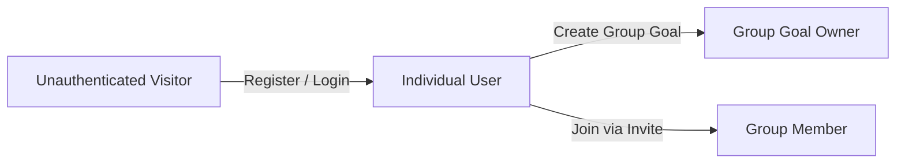
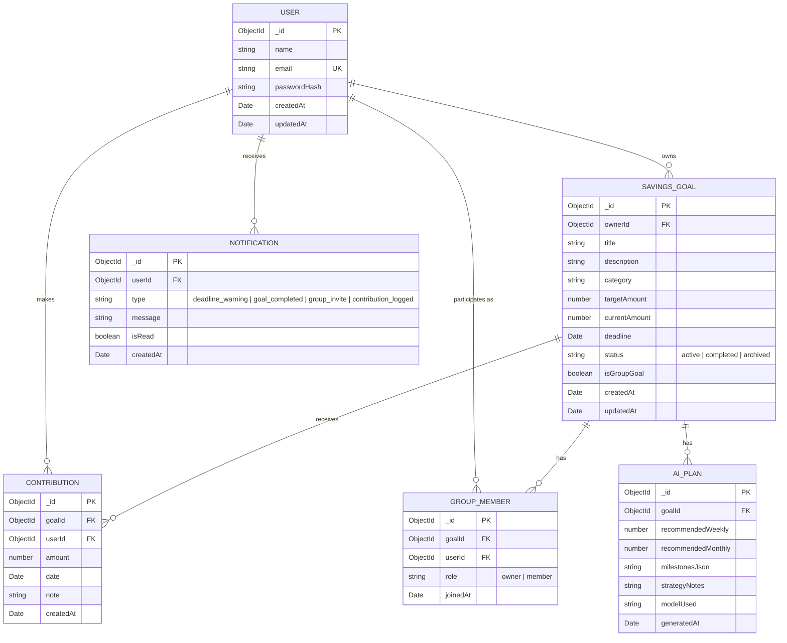

# SaveBuddy — Project Context & System Architecture

> **Project ID:** FIN-10  
> **Domain:** Finance / Personal Wealth Management  
> **Application Name:** SaveBuddy (Savings Goal Tracker)  
> **Core Technology Stack:** MERN Stack (MongoDB, Express.js, React, Node.js) + Google Gemini AI  
> **Specification Baseline:** Software Requirements Specification (SRS) v1.0 (October 2026)  

---

## 1. Executive Summary & Purpose

**SaveBuddy** is a full-stack financial web application designed to help individuals and collaborative groups define, monitor, and achieve their savings objectives. By bridging intuitive progress tracking with Google's Gemini AI, SaveBuddy transforms passive money tracking into proactive financial execution.

### Key Value Propositions
- **Clarity & Motivation:** Visual progress indicators, percentage meters, remaining balances, and time-to-deadline metrics.
- **AI-Powered Financial Roadmaps:** Automated calculation of realistic weekly and monthly contribution targets, milestone breakdowns, and timeline adjustments tailored to user constraints.
- **Collaborative Group Goals:** Shared pools for shared life moments (e.g., group vacations, roommate emergency funds, group gifts) with transparent member contribution tracking.
- **Security & Ownership:** Rigorous data isolation ensuring personal finances remain strictly confidential while allowing authorized multi-user collaboration.

---

## 2. High-Level Architecture

The system follows a modern decoupled client-server architecture with server-orchestrated AI integration.

```mermaid
flowchart TD
    subgraph Client["Frontend (React SPA)"]
        UI[User Interface / Dashboards]
        State[State Management & Context]
        APIClient[Axios / Fetch API Client]
        UI --> State
        State --> APIClient
    end

    subgraph Server["Backend (Node.js & Express.js)"]
        AuthMid[Auth & Authorization Middleware (JWT)]
        Router[REST API Routes]
        Controllers[Business Logic Controllers]
        Services[Service Layer]
        AIService[Gemini AI Integration Service]

        APIClient -->|HTTPS / JSON + Bearer Token| AuthMid
        AuthMid --> Router
        Router --> Controllers
        Controllers --> Services
        Services --> AIService
    end

    subgraph Data["Database & External Services"]
        MongoDB[(MongoDB Atlas / Local)]
        Gemini[Google Gemini AI API]

        Services -->|Mongoose ODM| MongoDB
        AIService -->|Secure Server-Side Calls| Gemini
    end
```

### Architectural Responsibilities

| Layer | Technology | Primary Responsibilities |
| :--- | :--- | :--- |
| **Frontend** | React (SPA), Vite / CRA, CSS / Tailwind | Responsive UI, goal visualizers, progress bars, contribution modals, group management, AI plan presentation. |
| **Backend** | Node.js, Express.js | REST APIs, request validation, JWT authentication, authorization guards, financial computations, Gemini prompt orchestration. |
| **Database** | MongoDB + Mongoose | Persistence for users, goals, contributions, group memberships, and cached AI plans. Indexed for query performance. |
| **AI Layer** | Google Gemini API (gemini-1.5-flash / gemini-2.5-flash) | Generates tailored contribution strategies, milestones, and timelines. Accessible strictly via backend credentials. |

---

## 3. System Scope & Boundaries

### 3.1 In-Scope Capabilities
- User registration, login, session management via JWT, and profile management.
- CRUD operations on personal savings goals with target dates, target amounts, and categories.
- Real-time contribution recording with atomic updates to current saved amounts.
- Dynamic savings progress tracking (percentage completion, remaining balances, days remaining).
- Automated goal completion state triggers when target amounts are satisfied.
- Server-side Gemini AI prompt generation delivering structured weekly/monthly savings plans.
- Group savings goals supporting multi-member participation, creator administration, and member-wise contribution ledgers.
- Responsive, accessible dashboard summarizing active, completed, and group targets.

### 3.2 Explicitly Out of Scope (Initial Release)
- **Direct Banking / Payment Rails:** No direct bank account linking (e.g., Plaid, Yodlee, UPI APIs) or automated money movement. All contributions are user-logged records.
- **Payment Processing & Escrow:** No real-money transactions, card processing, lending, or wallet holdings.
- **Fiduciary Financial & Tax Advice:** Gemini plans are explicitly labeled as informational estimates, not certified financial or tax advisory.
- **Credit Scoring / Loan Origination:** The app does not evaluate creditworthiness or interface with credit bureaus.

---

## 4. User Personas & Permissions



1. **Individual User:**
   - Manages personal goals and logs private contributions.
   - Requests AI-generated plans for personal goals.
   - Access is strictly restricted to their own records.
2. **Group Goal Owner (Creator):**
   - Possesses full administrative rights over a specific group goal (update details, archive, add/remove members).
   - Can record their own contributions and monitor all members' contributions.
3. **Group Member:**
   - Can view the collective goal target, deadline, and total progress.
   - Can view member-wise contribution breakdowns.
   - Can log their own contributions toward the group goal.
   - Cannot modify group metadata or remove other members.

---

## 5. Domain Data Models



### Data Validation Invariants
- **Target Amount:** Must be a positive decimal number $> 0$.
- **Contribution Amount:** Must be a positive decimal number $> 0$.
- **Deadline:** Must be a valid timestamp in the future ($> \text{Date.now()}$) at the time of goal creation.
- **Unique Group Membership:** Compound index on `(goalId, userId)` ensuring a user cannot be duplicated in the same group goal.
- **Progress Calculation:** $\text{Progress \%} = \min\left(100, \left(\frac{\text{currentAmount}}{\text{targetAmount}}\right) \times 100\right)$.
- **Status Automation:** If `currentAmount >= targetAmount`, status automatically switches to `'completed'`.

---

## 6. REST API Specification

All protected endpoints require the HTTP header: `Authorization: Bearer <JWT_TOKEN>`.

### 6.1 Authentication (`/api/auth`)
| Method | Endpoint | Access | Description |
| :--- | :--- | :--- | :--- |
| `POST` | `/api/auth/register` | Public | Register a new user with name, email, and password. |
| `POST` | `/api/auth/login` | Public | Authenticate user credentials and return a signed JWT. |
| `GET` | `/api/auth/me` | Protected | Fetch the authenticated user's profile details. |

### 6.2 Savings Goals (`/api/goals`)
| Method | Endpoint | Access | Description |
| :--- | :--- | :--- | :--- |
| `GET` | `/api/goals` | Protected | List all active/completed goals accessible to the user (personal + group). |
| `POST` | `/api/goals` | Protected | Create a new savings goal (validates positive target and future deadline). |
| `GET` | `/api/goals/:id` | Protected | Get specific goal details with progress and deadline calculations. |
| `PUT` | `/api/goals/:id` | Protected | Update goal metadata (Owner only). |
| `DELETE` | `/api/goals/:id` | Protected | Archive or soft-delete a goal (Owner only). |

### 6.3 Contributions (`/api/goals/:id/contributions`)
| Method | Endpoint | Access | Description |
| :--- | :--- | :--- | :--- |
| `POST` | `/api/goals/:id/contributions` | Protected | Log a new contribution (updates `currentAmount` atomically). |
| `GET` | `/api/goals/:id/contributions` | Protected | Retrieve paginated contribution history for the goal. |

### 6.4 Gemini AI Savings Plans (`/api/goals/:id/ai-plan`)
| Method | Endpoint | Access | Description |
| :--- | :--- | :--- | :--- |
| `POST` | `/api/goals/:id/ai-plan` | Protected | Trigger Gemini prompt generation; returns structured savings roadmap. |
| `GET` | `/api/goals/:id/ai-plan` | Protected | Retrieve the latest generated AI plan for the specified goal. |

### 6.5 Group Goals (`/api/group-goals`)
| Method | Endpoint | Access | Description |
| :--- | :--- | :--- | :--- |
| `POST` | `/api/group-goals` | Protected | Initialize a group savings goal with creator designated as owner. |
| `POST` | `/api/group-goals/:id/members` | Protected | Add an invited member by email/userId (Owner only). |
| `DELETE` | `/api/group-goals/:id/members/:userId` | Protected | Remove a member or leave group goal. |
| `GET` | `/api/group-goals/:id/breakdown` | Protected | View member-wise contribution aggregation and percentages. |

---

## 7. Gemini AI Integration Blueprint

The AI service operates strictly on the backend to safeguard the `GEMINI_API_KEY`.

### 7.1 Input Context Passed to Gemini
```json
{
  "goalTitle": "Emergency Fund",
  "category": "Safety Net",
  "targetAmount": 60000,
  "currentAmount": 15000,
  "remainingAmount": 45000,
  "deadline": "2027-04-01",
  "daysRemaining": 178,
  "userFinancialContext": {
    "monthlyIncome": 50000,
    "preferredContributionFrequency": "weekly",
    "savingsConstraints": "Moderate rent expenses"
  }
}
```

### 7.2 Expected Structured JSON Response
To ensure reliability, Gemini is instructed to respond strictly in valid JSON matching this schema:
```json
{
  "recommendedWeeklyContribution": 1770,
  "recommendedMonthlyContribution": 7670,
  "achievabilityScore": "Realistic",
  "milestones": [
    {
      "milestoneName": "30% Target Reached",
      "targetDate": "2026-11-15",
      "targetAmount": 18000,
      "actionTip": "Direct Diwali bonus into fund"
    },
    {
      "milestoneName": "Halfway Mark",
      "targetDate": "2027-01-01",
      "targetAmount": 30000,
      "actionTip": "Lock in automated weekly transfers"
    }
  ],
  "practicalRecommendations": [
    "Aim to set aside ₹1,770 every Monday.",
    "Allocate any unexpected windfalls directly to reduce final-month pressure."
  ],
  "disclaimer": "This plan is an automated estimate intended for guidance only and does not constitute guaranteed financial advisory."
}
```

### 7.3 Resilience & Fallback Handling
- **Timeout & Rate Limits:** Set client timeout (10s) and retry with exponential backoff on HTTP 429.
- **Graceful Degradation:** If Gemini is temporarily unavailable, the frontend displays standard mathematical pacing ($\frac{\text{remainingAmount}}{\text{weeksRemaining}}$) and alerts the user that AI suggestions can be retried later.

---

## 8. Non-Functional & Security Requirements

| Dimension | Standard & Requirement |
| :--- | :--- |
| **Authentication & Tokens** | JSON Web Tokens (JWT) signed with HMAC-SHA256, stored securely in HTTP-only cookies or client auth headers. Expire after a reasonable TTL (e.g., 7 days). |
| **Password Security** | Passwords hashed using `bcrypt` (work factor $\ge 10$) before persistence. Plaintext passwords never logged or returned. |
| **Data Isolation & Multi-Tenancy** | Middleware verifies that `req.user.id === goal.ownerId` or that `req.user.id` is in the `groupMembers` array before returning or modifying records. |
| **Input Sanitization** | Server-side validation using Joi / express-validator to block injection attacks, negative amounts, and invalid date formats. |
| **Secret Management** | All credentials (`MONGO_URI`, `JWT_SECRET`, `GEMINI_API_KEY`, `PORT`) strictly loaded via environment variables (`.env`). |
| **Performance & Indexing** | Compound indexes on `{ ownerId: 1, status: 1 }` and `{ goalId: 1, date: -1 }` to guarantee sub-100ms API responses under normal load. |
| **UI Responsiveness** | Fully fluid mobile-first responsive layout (usable on mobile 360px up to 4K desktop screens). |

---

## 9. Standard Project Directory Layout

```
SaveBuddy/
├── docs/
│   └── Savings_Goal_Tracker_SRS.docx    # Source requirements specification
├── context.md                           # Master context and architecture document (this file)
├── backend/
│   ├── src/
│   │   ├── config/                      # Database & Gemini SDK configuration
│   │   ├── controllers/                 # authController, goalController, contributionController, aiController
│   │   ├── middleware/                  # authMiddleware, validationMiddleware, errorHandler
│   │   ├── models/                      # User.js, Goal.js, Contribution.js, GroupMember.js, AIPlan.js
│   │   ├── routes/                      # authRoutes, goalRoutes, contributionRoutes, aiRoutes
│   │   ├── services/                    # geminiService.js, calculationService.js
│   │   └── server.js                    # Express app entry point
│   ├── package.json
│   └── .env.example
├── frontend/
│   ├── src/
│   │   ├── assets/                      # Icons, illustrations, styles
│   │   ├── components/                  # Navbar, GoalCard, ProgressBar, ContributionModal, AIPlanModal
│   │   ├── context/                     # AuthContext, GoalContext
│   │   ├── pages/                       # Dashboard, GoalDetails, GroupGoals, Login, Register
│   │   ├── services/                    # api.js (Axios client)
│   │   ├── App.jsx
│   │   └── main.jsx
│   ├── package.json
│   └── vite.config.js
└── README.md
```

---

## 10. Milestone & Implementation Roadmap

1. **Phase 1: Project Setup & Authentication**
   - Initialize Git repository, backend Express server, MongoDB Mongoose connections, and React frontend scaffolding.
   - Implement User schema, registration, login, password hashing, and JWT middleware.
2. **Phase 2: Core Goal Management & Contributions**
   - Create Goal and Contribution models with relational integrity.
   - Build CRUD endpoints and tests for goals and contributions.
   - Build frontend Dashboard, Goal creation forms, and real-time progress bar visualizations.
3. **Phase 3: Gemini AI Integration**
   - Configure Google Gemini backend SDK.
   - Implement prompt templates and structured JSON parsing.
   - Expose `/api/goals/:id/ai-plan` and build frontend interactive AI savings roadmap view.
4. **Phase 4: Collaborative Group Goals**
   - Implement GroupMember relations, invitation/addition logic, and member-wise contribution aggregation.
   - Build shared group dashboard view with collective and individual progress gauges.
5. **Phase 5: Refinement, Testing & Documentation**
   - Perform end-to-end integration testing, validation checks, and error boundary handling.
   - Deploy backend and frontend to hosting environments.
