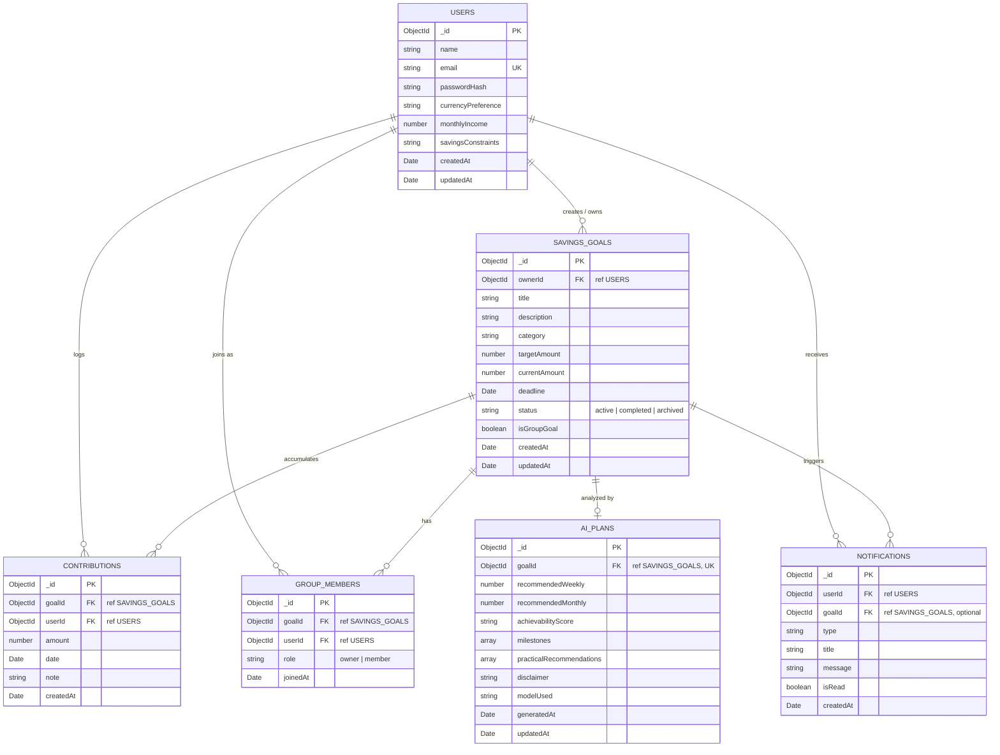
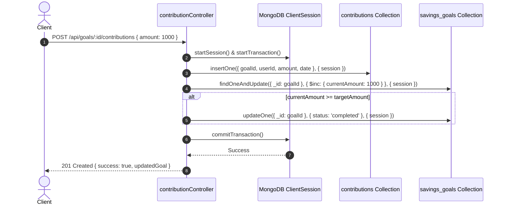

# SaveBuddy — Comprehensive Database Design & Data Architecture

> **Project ID:** FIN-10  
> **Application:** SaveBuddy (Savings Goal Tracker)  
> **Database Engine:** MongoDB (Document Database) with Mongoose ODM (Object Data Modeling)  
> **Version Baseline:** 1.0 (October 2026)  
> **Reference:** SRS v1.0, `context.md`, and `edge_cases.md`  

---

## 1. Architectural Philosophy & Modeling Strategy

MongoDB was selected for SaveBuddy to balance schema flexibility with strict relational integrity where financial consistency is paramount.

### 1.1 Hybrid Modeling Approach: Referenced vs. Embedded
- **Referenced Relationships (Normalization):**
  - Used when sub-items are **unbounded** in size (e.g., thousands of `contributions` per goal, multiple `group_members`, user `notifications`).
  - Prevents MongoDB's 16MB document size limit from being breached.
  - Ensures atomic operations on individual contribution records and allows high-throughput concurrent logging.
- **Embedded Subdocuments:**
  - Used when data is tightly coupled, bounded, and always read alongside the parent document (e.g., `milestones` inside `ai_plans`, user configuration settings).

### 1.2 Multi-Tenancy & Data Isolation Model
SaveBuddy enforces strict tenant boundary checks at the database query layer:
- Every personal query scopes to `ownerId === req.user.id`.
- Group operations scope through the `group_members` collection where `(goalId, userId)` exists.

---

## 2. Complete Entity-Relationship Diagram (ERD)



---

## 3. Detailed Collection Schemas & Data Dictionaries

### 3.1 `users` Collection

Stores registered user profiles, authentication credentials, and optional financial context used by Gemini AI.

| Field | BSON Type | Nullable | Default | Constraints & Description |
| :--- | :--- | :---: | :---: | :--- |
| `_id` | `ObjectId` | No | Auto | Primary Key |
| `name` | `String` | No | — | 2–100 chars, trimmed. User's full name. |
| `email` | `String` | No | — | **Unique**, lowercase, trimmed, valid email format. |
| `passwordHash` | `String` | No | — | Bcrypt hashed password (work factor $\ge 10$). Never plaintext. |
| `currencyPreference` | `String` | No | `"INR"` | ISO 4217 currency code (e.g., `"INR"`, `"USD"`, `"EUR"`). |
| `monthlyIncome` | `Number` | Yes | `null` | Optional self-reported monthly income for AI savings context. |
| `savingsConstraints`| `String` | Yes | `null` | Max 300 chars. Notes on fixed expenses for AI advice. |
| `createdAt` | `Date` | No | `Date.now` | Account creation timestamp. |
| `updatedAt` | `Date` | No | `Date.now` | Last profile update timestamp. |

#### Mongoose Schema Definition
```javascript
const userSchema = new mongoose.Schema({
  name: { type: String, required: true, trim: true, minlength: 2, maxlength: 100 },
  email: { type: String, required: true, unique: true, lowercase: true, trim: true },
  passwordHash: { type: String, required: true },
  currencyPreference: { type: String, default: 'INR', uppercase: true, trim: true },
  monthlyIncome: { type: Number, min: 0, default: null },
  savingsConstraints: { type: String, maxlength: 300, default: null }
}, { timestamps: true });

userSchema.index({ email: 1 }, { unique: true });
```

---

### 3.2 `savings_goals` Collection

Represents individual or collaborative savings targets with deadlines, financial milestones, and status states.

| Field | BSON Type | Nullable | Default | Constraints & Description |
| :--- | :--- | :---: | :---: | :--- |
| `_id` | `ObjectId` | No | Auto | Primary Key |
| `ownerId` | `ObjectId` | No | — | **Foreign Key** referencing `users._id`. |
| `title` | `String` | No | — | 3–100 chars, trimmed. Name of savings objective. |
| `description` | `String` | Yes | `""` | Max 500 chars, trimmed. Goal details / rationale. |
| `category` | `String` | No | `"other"` | Enum: `["emergency", "travel", "gadgets", "education", "vehicle", "home", "lifestyle", "other"]`. |
| `targetAmount` | `Number` | No | — | Positive number $> 0$, max $1,000,000,000$. |
| `currentAmount` | `Number` | No | `0` | Cumulative amount saved. Min 0. Atomically updated. |
| `deadline` | `Date` | No | — | UTC timestamp. Must be a future date on creation. |
| `status` | `String` | No | `"active"` | Enum: `["active", "completed", "archived"]`. |
| `isGroupGoal` | `Boolean` | No | `false` | Distinguishes solo goals from multi-member group pools. |
| `createdAt` | `Date` | No | `Date.now` | Creation timestamp. |
| `updatedAt` | `Date` | No | `Date.now` | Last update timestamp. |

#### Mongoose Schema Definition
```javascript
const savingsGoalSchema = new mongoose.Schema({
  ownerId: { type: mongoose.Schema.Types.ObjectId, ref: 'User', required: true, index: true },
  title: { type: String, required: true, trim: true, minlength: 3, maxlength: 100 },
  description: { type: String, trim: true, maxlength: 500, default: '' },
  category: { 
    type: String, 
    enum: ['emergency', 'travel', 'gadgets', 'education', 'vehicle', 'home', 'lifestyle', 'other'], 
    default: 'other' 
  },
  targetAmount: { type: Number, required: true, min: [1, 'Target amount must be at least 1'] },
  currentAmount: { type: Number, default: 0, min: 0 },
  deadline: { type: Date, required: true },
  status: { type: String, enum: ['active', 'completed', 'archived'], default: 'active', index: true },
  isGroupGoal: { type: Boolean, default: false, index: true }
}, { timestamps: true });

// Compound Indexes for High-Frequency Queries
savingsGoalSchema.index({ ownerId: 1, status: 1 });
savingsGoalSchema.index({ deadline: 1, status: 1 });
```

---

### 3.3 `contributions` Collection

Chronological ledger of every monetary addition made toward a savings goal.

| Field | BSON Type | Nullable | Default | Constraints & Description |
| :--- | :--- | :---: | :---: | :--- |
| `_id` | `ObjectId` | No | Auto | Primary Key |
| `goalId` | `ObjectId` | No | — | **Foreign Key** referencing `savings_goals._id`. |
| `userId` | `ObjectId` | No | — | **Foreign Key** referencing `users._id` (contributor). |
| `amount` | `Number` | No | — | Positive number $> 0$, rounded to 2 decimals. |
| `date` | `Date` | No | `Date.now` | Date contribution occurred (cannot be future date). |
| `note` | `String` | Yes | `""` | Optional note / memo (max 200 chars). |
| `createdAt` | `Date` | No | `Date.now` | Record insertion timestamp. |

#### Mongoose Schema Definition
```javascript
const contributionSchema = new mongoose.Schema({
  goalId: { type: mongoose.Schema.Types.ObjectId, ref: 'SavingsGoal', required: true, index: true },
  userId: { type: mongoose.Schema.Types.ObjectId, ref: 'User', required: true, index: true },
  amount: { type: Number, required: true, min: [0.01, 'Contribution must be greater than zero'] },
  date: { type: Date, default: Date.now },
  note: { type: String, trim: true, maxlength: 200, default: '' }
}, { timestamps: { createdAt: true, updatedAt: false } });

contributionSchema.index({ goalId: 1, date: -1 });
contributionSchema.index({ userId: 1, date: -1 });
```

---

### 3.4 `group_members` Collection

Maintains membership, invitation state, and permissions for shared collaborative savings goals.

| Field | BSON Type | Nullable | Default | Constraints & Description |
| :--- | :--- | :---: | :---: | :--- |
| `_id` | `ObjectId` | No | Auto | Primary Key |
| `goalId` | `ObjectId` | No | — | **Foreign Key** referencing `savings_goals._id`. |
| `userId` | `ObjectId` | No | — | **Foreign Key** referencing `users._id`. |
| `role` | `String` | No | `"member"` | Enum: `["owner", "member"]`. Creator is `"owner"`. |
| `joinedAt` | `Date` | No | `Date.now` | Membership join timestamp. |

#### Mongoose Schema Definition & Unique Constraint
```javascript
const groupMemberSchema = new mongoose.Schema({
  goalId: { type: mongoose.Schema.Types.ObjectId, ref: 'SavingsGoal', required: true },
  userId: { type: mongoose.Schema.Types.ObjectId, ref: 'User', required: true },
  role: { type: String, enum: ['owner', 'member'], default: 'member' },
  joinedAt: { type: Date, default: Date.now }
});

// CRITICAL: Prevent duplicate member entry in the same group goal
groupMemberSchema.index({ goalId: 1, userId: 1 }, { unique: true });
groupMemberSchema.index({ userId: 1 });
```

---

### 3.5 `ai_plans` Collection

Caches personalized savings roadmaps, milestone breakdowns, and financial guidance generated by Gemini AI.

| Field | BSON Type | Nullable | Default | Constraints & Description |
| :--- | :--- | :---: | :---: | :--- |
| `_id` | `ObjectId` | No | Auto | Primary Key |
| `goalId` | `ObjectId` | No | — | **Foreign Key** referencing `savings_goals._id`. **Unique**. |
| `recommendedWeekly` | `Number` | No | — | Calculated weekly contribution pace. |
| `recommendedMonthly`| `Number` | No | — | Calculated monthly contribution pace. |
| `achievabilityScore`| `String` | No | `"Realistic"` | Enum: `["Very Realistic", "Realistic", "Challenging", "Very Challenging"]`. |
| `milestones` | `Array` | No | `[]` | Embedded subdocuments of milestone checkpoints (schema below). |
| `practicalRecommendations` | `[String]` | No | `[]` | Array of actionable savings strategies. |
| `disclaimer` | `String` | No | Standard | Non-fiduciary advisory disclaimer. |
| `modelUsed` | `String` | No | `"gemini-1.5-flash"` | Name/version of Gemini LLM model used. |
| `generatedAt` | `Date` | No | `Date.now` | Generation timestamp. |

#### Embedded Milestone Subdocument Schema
```javascript
const milestoneSubSchema = new mongoose.Schema({
  milestoneName: { type: String, required: true },
  targetDate: { type: Date, required: true },
  targetAmount: { type: Number, required: true },
  actionTip: { type: String, required: true }
}, { _id: false });

const aiPlanSchema = new mongoose.Schema({
  goalId: { type: mongoose.Schema.Types.ObjectId, ref: 'SavingsGoal', required: true, unique: true },
  recommendedWeekly: { type: Number, required: true },
  recommendedMonthly: { type: Number, required: true },
  achievabilityScore: { 
    type: String, 
    enum: ['Very Realistic', 'Realistic', 'Challenging', 'Very Challenging'], 
    default: 'Realistic' 
  },
  milestones: [milestoneSubSchema],
  practicalRecommendations: [{ type: String, trim: true }],
  disclaimer: { 
    type: String, 
    default: 'This plan is an automated estimate for guidance only and does not constitute certified financial advisory.' 
  },
  modelUsed: { type: String, default: 'gemini-1.5-flash' }
}, { timestamps: { createdAt: 'generatedAt', updatedAt: true } });
```

---

### 3.6 `notifications` Collection

Stores in-app alerts for approaching deadlines, goal completion achievements, and group updates.

| Field | BSON Type | Nullable | Default | Constraints & Description |
| :--- | :--- | :---: | :---: | :--- |
| `_id` | `ObjectId` | No | Auto | Primary Key |
| `userId` | `ObjectId` | No | — | **Foreign Key** referencing `users._id` (recipient). |
| `goalId` | `ObjectId` | Yes | `null` | Optional **Foreign Key** referencing `savings_goals._id`. |
| `type` | `String` | No | — | Enum: `["deadline_warning", "goal_completed", "group_invite", "contribution_logged", "system"]`. |
| `title` | `String` | No | — | Alert headline (e.g., "Goal Completed!"). |
| `message` | `String` | No | — | Detailed notification text. |
| `isRead` | `Boolean` | No | `false` | Read status. |
| `createdAt` | `Date` | No | `Date.now` | Timestamp. |

#### Mongoose Schema Definition
```javascript
const notificationSchema = new mongoose.Schema({
  userId: { type: mongoose.Schema.Types.ObjectId, ref: 'User', required: true, index: true },
  goalId: { type: mongoose.Schema.Types.ObjectId, ref: 'SavingsGoal', default: null },
  type: { 
    type: String, 
    enum: ['deadline_warning', 'goal_completed', 'group_invite', 'contribution_logged', 'system'], 
    required: true 
  },
  title: { type: String, required: true },
  message: { type: String, required: true },
  isRead: { type: Boolean, default: false }
}, { timestamps: { createdAt: true, updatedAt: false } });

notificationSchema.index({ userId: 1, isRead: 1, createdAt: -1 });
```

---

## 4. Index Inventory & Query Optimization

Indexes are specifically configured to eliminate full collection scans (`COLLSCAN`) for primary dashboard and transactional operations.

| Collection | Index Keys | Type | Purpose / Query Profile |
| :--- | :--- | :---: | :--- |
| **`users`** | `{ email: 1 }` | Unique | Fast login & register lookup; enforces duplicate email prevention. |
| **`savings_goals`**| `{ ownerId: 1, status: 1 }` | Compound | Fetching user's active/completed goals on dashboard. |
| **`savings_goals`**| `{ deadline: 1, status: 1 }` | Compound | Identifying goals approaching deadline ($< 14$ days) for alerts. |
| **`contributions`** | `{ goalId: 1, date: -1 }` | Compound | Loading paginated contribution ledger sorted chronologically. |
| **`contributions`** | `{ userId: 1, date: -1 }` | Compound | Fetching user's personal activity feed across all goals. |
| **`group_members`**| `{ goalId: 1, userId: 1 }` | Compound Unique | Enforces single membership per goal; quick auth check. |
| **`group_members`**| `{ userId: 1 }` | Single | Querying all group goals a specific user participates in. |
| **`ai_plans`** | `{ goalId: 1 }` | Unique | 1-to-1 retrieval of cached AI plan for a goal. |
| **`notifications`**| `{ userId: 1, isRead: 1, createdAt: -1 }` | Compound | Fast retrieval of unread notifications for navbar bell icon. |

---

## 5. Aggregation Pipelines

### 5.1 Group Goal Member Contribution Breakdown Pipeline
Computes the exact total, contribution count, and percentage share for every member in a shared goal, including zero-contribution members.

```javascript
async function getGroupMemberBreakdown(goalId) {
  return await GroupMember.aggregate([
    { $match: { goalId: new mongoose.Types.ObjectId(goalId) } },
    {
      $lookup: {
        from: 'users',
        localField: 'userId',
        foreignField: '_id',
        as: 'userInfo'
      }
    },
    { $unwind: '$userInfo' },
    {
      $lookup: {
        from: 'contributions',
        let: { gId: '$goalId', uId: '$userId' },
        pipeline: [
          {
            $match: {
              $expr: {
                $and: [
                  { $eq: ['$goalId', '$$gId'] },
                  { $eq: ['$userId', '$$uId'] }
                ]
              }
            }
          },
          {
            $group: {
              _id: null,
              totalContributed: { $sum: '$amount' },
              contributionCount: { $sum: 1 }
            }
          }
        ],
        as: 'stats'
      }
    },
    {
      $project: {
        _id: 0,
        userId: '$userId',
        name: '$userInfo.name',
        email: '$userInfo.email',
        role: '$role',
        joinedAt: '$joinedAt',
        totalContributed: { 
          $ifNull: [{ $arrayElemAt: ['$stats.totalContributed', 0] }, 0] 
        },
        contributionCount: { 
          $ifNull: [{ $arrayElemAt: ['$stats.contributionCount', 0] }, 0] 
        }
      }
    },
    { $sort: { totalContributed: -1 } }
  ]);
}
```

### 5.2 User Dashboard Aggregate Metrics Pipeline
Computes high-level summary cards (Total Saved, Active Goals Count, Completed Goals Count, Urgent Goals) in a single optimized database trip using `$facet`.

```javascript
async function getUserDashboardStats(userId) {
  const [stats] = await SavingsGoal.aggregate([
    { $match: { ownerId: new mongoose.Types.ObjectId(userId) } },
    {
      $facet: {
        totals: [
          {
            $group: {
              _id: null,
              totalSaved: { $sum: '$currentAmount' },
              totalTarget: { $sum: '$targetAmount' },
              activeCount: {
                $sum: { $cond: [{ $eq: ['$status', 'active'] }, 1, 0] }
              },
              completedCount: {
                $sum: { $cond: [{ $eq: ['$status', 'completed'] }, 1, 0] }
              }
            }
          }
        ],
        urgentGoals: [
          {
            $match: {
              status: 'active',
              deadline: {
                $gte: new Date(),
                $lte: new Date(Date.now() + 14 * 24 * 60 * 60 * 1000) // Next 14 days
              }
            }
          },
          { $sort: { deadline: 1 } },
          { $limit: 5 },
          {
            $project: {
              title: 1,
              targetAmount: 1,
              currentAmount: 1,
              deadline: 1,
              category: 1
            }
          }
        ]
      }
    }
  ]);

  return {
    totalSaved: stats.totals[0]?.totalSaved || 0,
    totalTarget: stats.totals[0]?.totalTarget || 0,
    activeCount: stats.totals[0]?.activeCount || 0,
    completedCount: stats.totals[0]?.completedCount || 0,
    urgentGoals: stats.urgentGoals || []
  };
}
```

---

## 6. Transactional Consistency & Concurrency Control

### 6.1 Atomic Contribution Processing (ACID Session)
Logging a contribution requires writing to `contributions` and incrementing `savings_goals.currentAmount`. If either fails, both must roll back.



---

## 7. Data Lifecycle & Archival Strategy

1. **Soft Delete vs. Hard Delete:**
   - Savings goals are never purged via hard `deleteOne()` if they have historical contributions.
   - Deleting a goal triggers a status change: `status = 'archived'`.
   - Archived goals remain accessible to members for tax/savings audit records, but are excluded from active dashboards and AI plan refreshes.
2. **Cascading Rules:**
   - If an un-contributed goal is hard-deleted, any associated `ai_plans` and `group_members` records are purged in the same transaction.
3. **Data Types & Currency Handling:**
   - All amounts are stored as standard BSON double numbers rounded to 2 decimal places ($10.50$).
   - Calculations use explicit integer math in cents/paise ($\times 100$) where floating-point drift is a concern.
