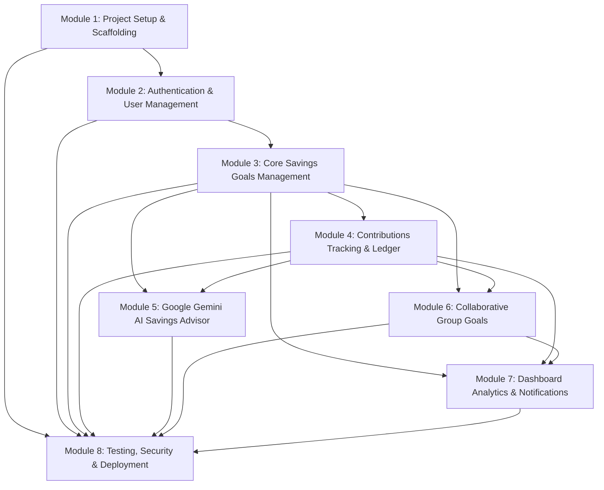

# SaveBuddy — Modular Implementation Plan

> **Project ID:** FIN-10  
> **Application:** SaveBuddy (Savings Goal Tracker)  
> **Architecture:** MERN Stack (MongoDB, Express.js, React, Node.js) + Google Gemini AI  
> **Reference:** Software Requirements Specification (SRS) v1.0 & `context.md`  

---

## Plan Overview & Module Dependency Graph

The implementation is broken down into **8 distinct, testable modules**. Each module defines exact deliverables across backend, frontend, database, security, and verification steps.



---

## Module 1: Project Setup, Environment & Foundation

### 1.1 Objective
Establish the repository structure, initialize backend and frontend workspaces, configure database connectivity with Mongoose, and define universal middleware and configuration standards.

### 1.2 Deliverables

#### Backend Deliverables
- **Folder structure:** `backend/src/{config,controllers,middleware,models,routes,services,utils}`.
- **Dependencies:** `express`, `mongoose`, `dotenv`, `cors`, `helmet`, `morgan`, `bcryptjs`, `jsonwebtoken`, `express-validator`.
- **Database Connection:** `src/config/db.js` with auto-reconnection and connection lifecycle logging.
- **Central Error Handler:** Custom `AppError` class and global error handling middleware returning standardized JSON responses:
  ```json
  {
    "success": false,
    "error": { "code": "ERROR_CODE", "message": "Human-readable message" }
  }
  ```
- **Environment Template:** `backend/.env.example` defining `PORT`, `MONGO_URI`, `JWT_SECRET`, `JWT_EXPIRES_IN`, `GEMINI_API_KEY`, `CLIENT_URL`.

#### Frontend Deliverables
- **Vite React App:** Initialized with React 18/19 and modern CSS / Tailwind CSS.
- **Folder structure:** `frontend/src/{assets,components,context,hooks,pages,services,utils}`.
- **Dependencies:** `react-router-dom`, `axios`, `lucide-react`, `clsx`, `tailwind-merge`.
- **API Client:** `src/services/api.js` configured with base URL, request interceptors (attaching Bearer token), and response interceptors (handling 401s).

### 1.3 Implementation Checklist
- [ ] Initialize Git repository with proper `.gitignore` (ignoring `node_modules`, `.env`, build outputs).
- [ ] Initialize `backend/package.json` and install required dependencies.
- [ ] Create `backend/src/server.js` with basic healthcheck route (`GET /api/health`).
- [ ] Configure Mongoose connection in `backend/src/config/db.js`.
- [ ] Initialize `frontend/` using Vite + React template and configure Tailwind CSS.
- [ ] Configure Axios instance with interceptors in `frontend/src/services/api.js`.

### 1.4 Acceptance Criteria
- [x] Running `npm run dev` in both directories starts server and client without errors.
- [x] `GET http://localhost:5000/api/health` returns `{ "status": "ok", "timestamp": "..." }`.
- [x] Database connects cleanly to local or MongoDB Atlas instance.

---

## Module 2: Authentication & User Management (FR-01)

### 2.1 Objective
Implement secure user registration, login, password hashing, JWT generation, and route protection for both backend APIs and frontend routes.

### 2.2 Deliverables

#### Backend Components
- **Model:** `backend/src/models/User.js`
  - Fields: `name` (string, required), `email` (string, required, unique, lowercase, trimmed), `passwordHash` (string, required), `createdAt`, `updatedAt`.
  - Mongoose pre-save hook to hash passwords with `bcryptjs` (salt rounds: 10).
  - Instance method: `comparePassword(candidatePassword)`.
- **Validation:** `backend/src/middleware/validators/authValidator.js`
  - Email format validation, password minimum 6 characters, name trimmed and not empty.
- **Controller:** `backend/src/controllers/authController.js`
  - `register`: Validates uniqueness, creates user, returns token + user payload.
  - `login`: Verifies email and password hash, returns token + user payload.
  - `getMe`: Returns authenticated user profile (excluding password hash).
- **Middleware:** `backend/src/middleware/authMiddleware.js`
  - Extracts Bearer token from `Authorization` header, verifies JWT, attaches `req.user`.
- **Routes:** `backend/src/routes/authRoutes.js`
  - `POST /api/auth/register`
  - `POST /api/auth/login`
  - `GET /api/auth/me` (Protected)

#### Frontend Components
- **Auth Context:** `frontend/src/context/AuthContext.jsx`
  - Exposes `user`, `token`, `isAuthenticated`, `login()`, `register()`, `logout()`, `loading`.
  - Syncs token with `localStorage`.
- **Protected Route Guard:** `frontend/src/components/common/ProtectedRoute.jsx`
  - Redirects unauthenticated users to `/login`.
- **Pages:**
  - `frontend/src/pages/auth/LoginPage.jsx` (email, password, validation error states).
  - `frontend/src/pages/auth/RegisterPage.jsx` (name, email, password, confirm password).
- **Navbar:** Displays user greeting and logout button when authenticated.

### 2.3 Implementation Checklist
- [ ] Create `User` Mongoose schema with email index and bcrypt hashing.
- [ ] Implement `authController.js` with registration, login, and getMe functions.
- [ ] Implement `authMiddleware.js` for JWT token verification.
- [ ] Mount `authRoutes` onto `/api/auth` in `server.js`.
- [ ] Create `AuthContext` on frontend to store user session.
- [ ] Build `LoginPage` and `RegisterPage` with form validation.
- [ ] Wrap protected application pages in `ProtectedRoute`.

### 2.4 Acceptance Criteria
- [x] New user can register; duplicate email registration returns HTTP 409.
- [x] Valid login issues a JWT; invalid login returns HTTP 401.
- [x] Protected routes reject requests without a valid Bearer token.
- [x] Passwords are never stored or returned in plain text.

---

## Module 3: Core Savings Goals Management (FR-02, FR-03, FR-05)

### 3.1 Objective
Enable users to create, view, update, delete, and monitor personal savings goals with target amounts, deadlines, and automated progress calculations.

### 3.2 Deliverables

#### Backend Components
- **Model:** `backend/src/models/SavingsGoal.js`
  - Fields: `ownerId` (ref: User), `title`, `description`, `category` (e.g., Emergency, Travel, Gadgets, Education), `targetAmount` (number $> 0$), `currentAmount` (default 0), `deadline` (future date), `status` ('active' | 'completed' | 'archived'), `isGroupGoal` (boolean, default false).
  - Index on `{ ownerId: 1, status: 1 }`.
- **Validation:** `backend/src/middleware/validators/goalValidator.js`
  - Validates positive `targetAmount`, non-empty `title`, valid future `deadline`.
- **Controller:** `backend/src/controllers/goalController.js`
  - `createGoal`: Creates goal with initial amount 0 (or starting contribution).
  - `getGoals`: Retrieves all active/completed goals owned by user.
  - `getGoalById`: Retrieves goal, calculates remaining amount and days to deadline.
  - `updateGoal`: Updates title, description, category, or deadline (Owner only).
  - `deleteGoal`: Soft deletes or archives goal (Owner only).
- **Routes:** `backend/src/routes/goalRoutes.js`
  - `POST /api/goals`
  - `GET /api/goals`
  - `GET /api/goals/:id`
  - `PUT /api/goals/:id`
  - `DELETE /api/goals/:id`

#### Frontend Components
- **Components:**
  - `frontend/src/components/goals/GoalCard.jsx`: Displays title, category badge, target, current amount, percentage progress bar, remaining days.
  - `frontend/src/components/goals/ProgressBar.jsx`: Animated visual meter with color gradation (e.g., blue to green on completion).
  - `frontend/src/components/goals/GoalFormModal.jsx`: Modal for creating and editing goals with field validations.
- **Pages:**
  - `frontend/src/pages/goals/GoalsPage.jsx`: Filterable list of active, completed, and archived goals.
  - `frontend/src/pages/goals/GoalDetailsPage.jsx`: In-depth view showing progress circle, balance breakdown, contribution log, and AI plan.

### 3.3 Implementation Checklist
- [ ] Create `SavingsGoal` Mongoose schema and indexes.
- [ ] Write controller functions for goal CRUD with strict ownership verification.
- [ ] Add route validations for target amount and future deadline.
- [ ] Build `GoalCard` and responsive `ProgressBar` frontend components.
- [ ] Create `GoalFormModal` with client-side error checking.
- [ ] Implement `GoalsPage` with status filter tabs (All, Active, Completed).

### 3.4 Acceptance Criteria
- [x] User can create a goal with title, target amount, and future deadline.
- [x] Invalid targets ($\le 0$) or past deadlines are rejected with clear validation messages.
- [x] Progress bar calculates accurate percentage: $\min\left(100, \frac{\text{current}}{\text{target}} \times 100\right)$.
- [x] Users can only view and edit their own goals.

---

## Module 4: Contributions Tracking & Ledger (FR-04)

### 4.1 Objective
Allow users to log monetary contributions to a goal, atomically updating the goal's saved amount, recalculating progress, and recording a historical ledger.

### 4.2 Deliverables

#### Backend Components
- **Model:** `backend/src/models/Contribution.js`
  - Fields: `goalId` (ref: SavingsGoal), `userId` (ref: User), `amount` (number $> 0$), `date` (Date, default `Date.now`), `note` (string, optional).
  - Index on `{ goalId: 1, date: -1 }`.
- **Controller:** `backend/src/controllers/contributionController.js`
  - `addContribution`:
    1. Validates amount $> 0$ and verifies user authorization for the goal.
    2. Inserts new `Contribution` document.
    3. Atomically increments goal's `currentAmount` using `$inc`.
    4. Evaluates if `newCurrentAmount >= targetAmount`; if true, transitions `status = 'completed'`.
  - `getContributions`: Retrieves paginated history of contributions for a goal.
- **Routes:** `backend/src/routes/contributionRoutes.js`
  - `POST /api/goals/:id/contributions`
  - `GET /api/goals/:id/contributions`

#### Frontend Components
- **Components:**
  - `frontend/src/components/contributions/AddContributionModal.jsx`: Quick form with amount input, date picker, note textarea, and validation.
  - `frontend/src/components/contributions/ContributionHistoryList.jsx`: Timeline or table displaying date, contributor name, note, and amount added.
- **State Update:** Instant optimistic or reactive update to the goal's progress bar upon contribution submission.

### 4.3 Implementation Checklist
- [ ] Define `Contribution` schema with indexes.
- [ ] Implement atomic contribution recording and goal progress update in `contributionController.js`.
- [ ] Implement automatic transition to `'completed'` status when target is achieved.
- [ ] Build `AddContributionModal` with quick presets (e.g., +₹500, +₹1,000, +₹5,000).
- [ ] Build `ContributionHistoryList` component with chronological sorting.

### 4.4 Acceptance Criteria
- [x] Contribution amount must be strictly greater than 0.
- [x] Goal `currentAmount` and progress percentage update immediately upon logging contribution.
- [x] Goal status updates to `completed` once current amount meets or exceeds target amount.
- [x] Contribution ledger correctly attributes user and timestamp.

---

## Module 5: Google Gemini AI Savings Advisor (FR-06)

### 5.1 Objective
Integrate Google Gemini AI via the backend to analyze goal parameters (target, deadline, current savings, user constraints) and generate actionable weekly/monthly savings plans and milestone projections.

### 5.2 Deliverables

#### Backend Components
- **Service:** `backend/src/services/geminiService.js`
  - Configures `@google/genai` (or `@google/generative-ai`) with `GEMINI_API_KEY`.
  - Builds structured prompt with goal context (target, balance, remaining days, income/budget if provided).
  - Enforces JSON output mode using Gemini schema definition or strict prompt formatting.
  - Implements fallback calculation algorithm if Gemini API is unreachable or rate-limited.
- **Model:** `backend/src/models/AIPlan.js`
  - Fields: `goalId`, `recommendedWeekly`, `recommendedMonthly`, `achievabilityScore`, `milestones` (Array of objects), `practicalRecommendations` (Array of strings), `disclaimer`, `modelUsed`, `generatedAt`.
- **Controller:** `backend/src/controllers/aiController.js`
  - `generatePlan`: Calls Gemini service, saves or updates `AIPlan` in database, returns JSON plan.
  - `getPlan`: Returns existing saved plan for the goal.
- **Routes:** `backend/src/routes/aiRoutes.js`
  - `POST /api/goals/:id/ai-plan`
  - `GET /api/goals/:id/ai-plan`

#### Frontend Components
- **Components:**
  - `frontend/src/components/ai/AIPlanView.jsx`: Card displaying weekly/monthly savings targets, achievability badge, and tips.
  - `frontend/src/components/ai/MilestoneTimeline.jsx`: Visual step-by-step milestone path to goal completion.
  - `frontend/src/components/ai/GeneratePlanButton.jsx`: Trigger button with loading spinner, error handling, and retry option.
  - `frontend/src/components/ai/FinancialContextModal.jsx`: Optional modal allowing user to provide monthly income or spending constraints before AI generation.

### 5.3 Implementation Checklist
- [ ] Set up Gemini SDK on backend in `geminiService.js`.
- [ ] Create system prompt ensuring deterministic JSON response with milestones and recommendations.
- [ ] Define `AIPlan` Mongoose schema.
- [ ] Implement backend fallback mathematical pacing calculation for offline resilience.
- [ ] Build frontend `AIPlanView` with animated milestone progression and disclaimer banner.

### 5.4 Acceptance Criteria
- [x] Client requests never expose the `GEMINI_API_KEY`.
- [x] AI plan returns realistic weekly/monthly savings targets based on deadline.
- [x] API handles Gemini rate-limits (HTTP 429) or timeouts gracefully with clear user feedback.
- [x] AI output includes explicit disclaimer that recommendations are informational and not financial advice.

---

## Module 6: Collaborative Group Goals (FR-07)

### 6.1 Objective
Allow multiple users to pool funds for shared objectives (group trips, shared gadgets, emergency reserves) with group administration, invite mechanics, and individual contribution transparency.

### 6.2 Deliverables

#### Backend Components
- **Model:** `backend/src/models/GroupMember.js`
  - Fields: `goalId` (ref: SavingsGoal), `userId` (ref: User), `role` ('owner' | 'member'), `joinedAt`.
  - Compound unique index on `{ goalId: 1, userId: 1 }`.
- **Authorization Guard:** `backend/src/middleware/groupAuthMiddleware.js`
  - Ensures only group owner can invite/remove members or edit goal details.
  - Ensures any valid group member can log contributions and view group progress.
- **Controller:** `backend/src/controllers/groupGoalController.js`
  - `createGroupGoal`: Creates goal with `isGroupGoal: true` and adds creator as `'owner'`.
  - `addMember`: Finds user by email and adds them as `'member'`.
  - `removeMember`: Removes member (Owner only, or self-leave).
  - `getGroupBreakdown`: Aggregates contributions by user to compute each member's total and percentage share.
- **Routes:** `backend/src/routes/groupGoalRoutes.js`
  - `POST /api/group-goals`
  - `POST /api/group-goals/:id/members`
  - `DELETE /api/group-goals/:id/members/:userId`
  - `GET /api/group-goals/:id/breakdown`

#### Frontend Components
- **Components:**
  - `frontend/src/components/groups/GroupMemberBadge.jsx`: Displays avatar, name, and total amount contributed.
  - `frontend/src/components/groups/AddMemberModal.jsx`: Form to add a user to the group by email.
  - `frontend/src/components/groups/MemberContributionChart.jsx`: Horizontal stacked bar or breakdown list showing contribution proportions.
- **Pages:**
  - `frontend/src/pages/groups/GroupGoalsPage.jsx`: Filtered dashboard showing shared goals.
  - `frontend/src/pages/groups/GroupGoalDetailsPage.jsx`: Shared progress meter, member roster, and group activity feed.

### 6.3 Implementation Checklist
- [ ] Implement `GroupMember` schema with unique compound index.
- [ ] Create group authorization middleware verifying ownership vs. membership.
- [ ] Implement aggregation pipeline for member-wise contribution breakdown.
- [ ] Build `GroupGoalDetailsPage` displaying collective progress and individual member stats.
- [ ] Build `AddMemberModal` with email lookup and duplicate prevention.

### 6.4 Acceptance Criteria
- [x] Only group owner can add or remove members.
- [x] Any authorized member can add contributions to the group goal.
- [x] Total group progress updates dynamically, and member contribution breakdown is transparent.
- [x] Non-members cannot view or contribute to private group goals.

---

## Module 7: Dashboard Summaries, Alerts & Notifications (FR-08, FR-09)

### 7.1 Objective
Provide users with a centralized financial overview dashboard with real-time metrics, approaching deadline alerts, goal completion achievements, and in-app notifications.

### 7.2 Deliverables

#### Backend Components
- **Controller:** `backend/src/controllers/dashboardController.js`
  - `getSummary`: Aggregates total saved amount across all goals, total active goals, completed goals count, and upcoming deadlines within 14 days.
- **Model:** `backend/src/models/Notification.js`
  - Fields: `userId`, `type` (`deadline_alert`, `goal_completed`, `group_invite`, `contribution_received`), `message`, `isRead` (boolean, default false), `createdAt`.
- **Routes:** `backend/src/routes/dashboardRoutes.js` & `backend/src/routes/notificationRoutes.js`
  - `GET /api/dashboard/summary`
  - `GET /api/notifications`
  - `PUT /api/notifications/:id/read`

#### Frontend Components
- **Components:**
  - `frontend/src/components/dashboard/StatCard.jsx`: Metric widget with icon, title, value, and trend indicator.
  - `frontend/src/components/dashboard/UrgentGoalsList.jsx`: Highlights goals nearing deadlines ($< 14$ days).
  - `frontend/src/components/notifications/NotificationBell.jsx`: Bell icon with unread badge count and dropdown popover.
  - `frontend/src/components/common/CelebrationModal.jsx`: Confetti animation triggering when a goal reaches 100% completion.
- **Pages:**
  - `frontend/src/pages/dashboard/DashboardPage.jsx`: Comprehensive home view integrating stats, recent goals, and urgent alerts.

### 7.3 Implementation Checklist
- [ ] Build backend summary aggregation endpoint.
- [ ] Create `Notification` model and notification dispatch helpers.
- [ ] Build `DashboardPage` layout featuring 4 key stat cards: Total Saved, Active Goals, Completed Goals, Next Milestone.
- [ ] Implement in-app `NotificationBell` with read/unread toggle.
- [ ] Add confetti celebration when a user finishes a goal.

### 7.4 Acceptance Criteria
- [x] Dashboard summary computes accurate aggregate numbers across user's goals.
- [x] Goals nearing deadline are highlighted with urgency badges.
- [x] Completing a goal displays congratulatory feedback and logs a completion notification.

---

## Module 8: Testing, Security Audits & Deployment (Section 14 & 15)

### 8.1 Objective
Verify end-to-end reliability through automated unit/integration tests, harden API security against common vulnerabilities, and prepare production deployment builds.

### 8.2 Deliverables

#### Testing Suite
- **Backend Tests (Jest + Supertest):**
  - `tests/auth.test.js`: Registration, login, duplicate check, JWT validation.
  - `tests/goals.test.js`: Goal CRUD, validation (negative targets, past dates), ownership isolation.
  - `tests/contributions.test.js`: Atomic balance increment, completion status auto-trigger.
  - `tests/groups.test.js`: Role enforcement (owner vs. member permissions).
  - `tests/ai.test.js`: Gemini service mocking and fallback calculations.
- **Frontend Tests (Vitest + React Testing Library):**
  - Form validation on goal creation and login.
  - Progress bar percentage rendering and boundary conditions.

#### Security & Hardening Checklist
- [ ] Add `helmet` for HTTP security headers.
- [ ] Add `express-rate-limit` to prevent brute-force attacks on `/api/auth/*` and `/api/goals/:id/ai-plan`.
- [ ] Ensure all input data is validated with `express-validator` and sanitized against NoSQL injection.
- [ ] Configure strict CORS to only allow requests from approved client origin.
- [ ] Confirm no secrets or API keys are committed or exposed to the client bundle.

#### Deployment Preparation
- **Backend:** `Dockerfile` or PM2 process config for Node.js hosting (e.g., Render, Railway).
- **Frontend:** Optimized production build with Vite (`npm run build`), served via static hosting (e.g., Vercel, Netlify).

### 8.3 Acceptance Criteria
- [x] All automated tests pass with $> 80\%$ test coverage on critical business logic.
- [x] Security audit passes without high or critical severity vulnerabilities (`npm audit`).
- [x] Frontend production build compiles cleanly without lint or type errors.

---

## Master Implementation Schedule & Milestones

| Milestone | Modules | Focus | Target Outcome |
| :--- | :--- | :--- | :--- |
| **Milestone 1** | Module 1 & 2 | Scaffolding & Authentication | Secure registration, login, and token-based API protection. |
| **Milestone 2** | Module 3 & 4 | Goals & Contributions Core | Complete personal goal tracking with atomic updates and visual progress. |
| **Milestone 3** | Module 5 | Gemini AI Integration | Backend-orchestrated AI savings roadmaps and milestone projections. |
| **Milestone 4** | Module 6 | Collaborative Group Goals | Multi-member goals with transparent contribution ledgers and ownership controls. |
| **Milestone 5** | Module 7 & 8 | Dashboard, Testing & Release | Unified dashboard, alerts, end-to-end tests, security hardening, and deployment. |
