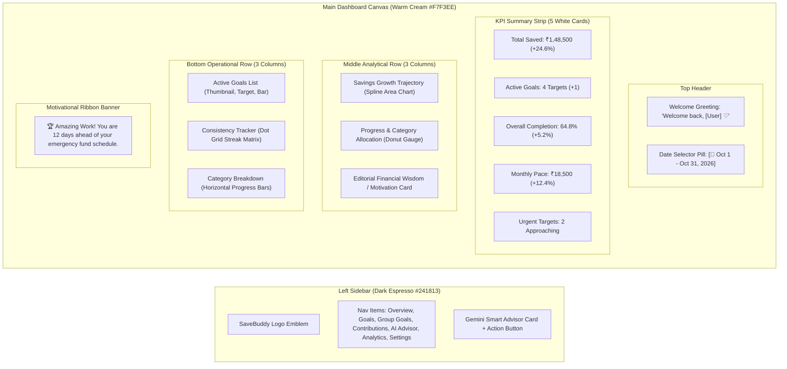

# SaveBuddy — UI/UX Design System & Implementation Plan

> **Project ID:** FIN-10  
> **Application:** SaveBuddy (Savings Goal Tracker)  
> **Design Aesthetic:** Warm Coffee & Cream Luxury Minimalist Dashboard  
> **Reference Design:** Warm earthy neutral palette, espresso sidebar, cream backdrop, elegant serif headings, and refined data visualization cards  
> **Version Baseline:** 1.0 (October 2026)  

---

## 1. Visual Design Philosophy & Moodboard Deconstruction

The user interface for **SaveBuddy** is inspired by a warm, high-end editorial aesthetic. Unlike conventional cold, neon-blue fintech interfaces, SaveBuddy uses an organic, calming, and luxurious **Warm Earth-Tone / Coffee & Cream** aesthetic. Saving money should feel rewarding, serene, and disciplined rather than stressful.

```
┌────────────────────────────────────────────────────────────────────────────────────────┐
│                              PALETTE VISUAL HARMONY                                    │
│                                                                                        │
│   #241813       #3B261E       #A76D49       #C69A7B       #F7F3EE       #FFFFFF        │
│  [Espresso]     [Mocha]      [Caramel]      [Latte]       [Cream]       [Pure White]   │
│  Sidebar &     Dark Card     Primary CTA   Secondary    Dashboard       Card Base      │
│  Dark Base     Surfaces      & Highlights   Accents     Background                     │
└────────────────────────────────────────────────────────────────────────────────────────┘
```

### Core Design Pillars
1. **Warmth & Serenity:** Soft cream canvas (`#F7F3EE` / `#FAF6F0`) replacing harsh bright white backdrops, paired with rich espresso brown navigation elements (`#241813`).
2. **Editorial Typography:** High-contrast luxury serif display headings (`Playfair Display` or `Cormorant Garamond`) paired with razor-sharp geometric sans-serif for numbers and metrics (`Plus Jakarta Sans` or `Inter`).
3. **Gentle Tactility:** Generously rounded corners (`rounded-2xl` to `rounded-3xl`), ultra-subtle warm ambient drop shadows (`0 8px 30px rgba(59, 38, 30, 0.05)`), and soft borders.
4. **Visual Progression:** Radial donut progress gauges, smooth spline area growth curves, and weekly contribution habit heatmaps that celebrate daily consistency.

---

## 2. Design System & Style Tokens

### 2.1 Color Palette (Tailwind Configuration)

```javascript
// tailwind.config.js - extended theme colors
module.exports = {
  theme: {
    extend: {
      colors: {
        coffee: {
          50: '#FDFBF9',
          100: '#F7F3EE',   // Primary Dashboard Background
          200: '#EDE4D8',   // Soft Borders & Separators
          300: '#D8C5B2',   // Muted Text & Disabled Pills
          400: '#C69A7B',   // Warm Tan / Latte Accent
          500: '#A76D49',   // Terracotta / Caramel (Primary Active)
          600: '#8A5432',   // Deep Terracotta Hover
          700: '#5E3823',   // Dark Mocha
          800: '#3B261E',   // Cocoa Card Accents / Sidebar Hover
          900: '#241813',   // Deep Espresso (Sidebar Background)
          950: '#170E0B',   // Deepest Midnight Roast
        },
        sage: {
          50: '#F2F8F4',
          100: '#E2F0E6',
          500: '#3D8C55',   // Positive growth badges (+24.6%)
          700: '#2A633B',
        },
        cream: {
          surface: '#FFFFFF',
          card: '#FFFFFF',
          soft: '#FBF8F5',
          border: 'rgba(59, 38, 30, 0.08)',
        }
      },
      fontFamily: {
        serif: ['Playfair Display', 'Cormorant Garamond', 'Georgia', 'serif'],
        sans: ['Plus Jakarta Sans', 'Inter', 'sans-serif'],
      },
      boxShadow: {
        'warm-sm': '0 2px 8px rgba(36, 24, 19, 0.04)',
        'warm-md': '0 8px 24px rgba(36, 24, 19, 0.06)',
        'warm-lg': '0 16px 40px rgba(36, 24, 19, 0.08)',
        'warm-glow': '0 0 20px rgba(167, 109, 73, 0.25)',
      },
      borderRadius: {
        '2xl': '1.25rem',
        '3xl': '1.75rem',
      }
    }
  }
}
```

### 2.2 Typography Hierarchy

| Style Element | Font Family | Size / Weight | Line Height | Tailwind Class | Usage |
| :--- | :--- | :--- | :--- | :--- | :--- |
| **Welcome Heading** | Serif | 32px / Medium (500) | 1.2 | `font-serif text-3xl font-medium text-coffee-950` | Top greeting banner (`Welcome back, Jane`) |
| **Section Header** | Sans | 18px / SemiBold (600) | 1.3 | `font-sans text-lg font-semibold text-coffee-900` | Card titles (`Savings Growth`, `Active Goals`) |
| **KPI Primary Metric** | Sans | 28px / Bold (700) | 1.1 | `font-sans text-2xl md:text-3xl font-bold text-coffee-950 tracking-tight` | Large numbers (`₹1,48,500`, `2.68K`) |
| **Percentage Pill** | Sans | 12px / Medium (500) | 1.0 | `font-sans text-xs font-semibold text-sage-700 bg-sage-100 rounded-full px-2 py-0.5` | Trend tags (`+24.6% vs last month`) |
| **Label / Subtitle** | Sans | 13px / Regular (400) | 1.4 | `font-sans text-xs md:text-sm text-coffee-600` | Metric captions, secondary dates |
| **Editorial Quote** | Serif | 16px / Italic (400) | 1.6 | `font-serif text-base italic text-coffee-800` | Wisdom quotes and AI insights |

---

## 3. Master Dashboard Layout Architecture

The overall interface is laid out as a **two-column desktop layout**: an anchored dark espresso sidebar on the left, and a fluid, card-based dashboard canvas on the right.



---

## 4. Component-by-Component Specifications

### 4.1 Left Navigation Sidebar (Dark Espresso `#241813`)
- **Width:** 260px fixed on desktop ($> 1024\text{px}$); collapsible drawer on tablet/mobile.
- **Brand Header:**
  - Circular dark cocoa badge with gold foil border (`border-coffee-500/30`).
  - Text: **SaveBuddy** in elegant serif letter-spacing with `"FINANCE & GOALS"` subtitle.
- **Navigation Links:**
  - Standard items:
    - 🏠 **Overview** (Active state: `bg-coffee-500 text-white rounded-xl shadow-warm-sm font-medium`)
    - 🎯 **Goals** (`text-coffee-300 hover:text-white hover:bg-coffee-800/60 rounded-xl transition`)
    - 👥 **Group Goals** (with small member count pill)
    - 💳 **Contributions** (ledger & transaction history)
    - ✨ **AI Smart Advisor** (Gemini AI savings plan generator)
    - 📊 **Analytics & Reports** (historical savings trajectory)
    - ⚙️ **Settings** (currency preference, monthly income, constraints)
- **Sidebar Feature Callout Card (Bottom):**
  - Dark chocolate textured container (`bg-coffee-800/80 border border-coffee-700/50 rounded-2xl p-4 text-center`).
  - Icon: Glowing gem/sparkle ✨ in gold.
  - Heading: `"AI Smart Pacing"`
  - Description: `"Unlock customized savings milestones with Gemini AI."`
  - Button: `"Generate Plan"` (`bg-gradient-to-r from-coffee-500 to-coffee-600 text-white rounded-lg py-2 text-xs font-semibold hover:shadow-warm-glow transition`).

---

### 4.2 Top Header & Greeting Bar
- **Greeting Section:**
  - `"Welcome back,"` in light muted mocha sans-serif (`text-coffee-600 text-sm font-medium`).
  - `"[User Name] ♡"` in rich serif display font (`font-serif text-3xl md:text-4xl text-coffee-950 font-medium tracking-tight`).
  - Dynamic Subtitle: `"Here's how your savings goals are performing this month."`
- **Date Range Selector Pill:**
  - Soft white pill with border: `bg-white/80 backdrop-blur-sm border border-coffee-200 rounded-full px-4 py-2 shadow-warm-sm`.
  - Icon: Lucide `Calendar` in terracotta `#A76D49`.
  - Label: `"Oct 1 – Oct 31, 2026"` with subtle dropdown arrow.

---

### 4.3 Top KPI Summary Strip (5 Balanced White Cards)
Each card is built on pure white (`#FFFFFF`) with `rounded-2xl`, `p-5`, `border border-coffee-200/60`, and `shadow-warm-sm`:

| Metric Card | Icon & Badge Color | Primary Figure | Trend Pill | Description / Comparison |
| :--- | :--- | :--- | :--- | :--- |
| **Total Saved** | 💰 Soft tan circular icon (`bg-coffee-50 text-coffee-600`) | **₹1,48,500** | `+24.6%` (Green) | `vs Sep 1 – Sep 30` |
| **Active Goals** | 🎯 Soft terracotta icon (`bg-coffee-500/10 text-coffee-500`) | **4 Targets** | `+1 New` (Green) | `All on active schedule` |
| **Overall Completion** | 📈 Soft mocha icon (`bg-coffee-700/10 text-coffee-700`) | **64.8%** | `+5.2%` (Green) | `Paced for March deadline` |
| **Monthly Savings Pace** | ⏳ Soft gold icon (`bg-amber-50 text-amber-700`) | **₹18,500** | `+12.4%` (Green) | `Weekly target: ₹4,625` |
| **Upcoming Deadlines** | 🔔 Soft rose icon (`bg-rose-50 text-rose-600`) | **2 Goals** | `14 Days` (Amber) | `Goa Trip & Emergency Fund` |

---

### 4.4 Middle Analytics Grid (3 Core Widgets)

#### Widget 1: Savings Growth & Trajectory (50% Width)
- **Component:** Line / Area Chart using Chart.js or Recharts with custom SVG spline curves.
- **Header:** `"Savings Growth"` with secondary label `"Total Saved: ₹1,48,500"`.
- **Styling:**
  - Line color: Terracotta caramel `#A76D49` with thickness `3px`.
  - Area fill: Vertical gradient from `rgba(167, 109, 73, 0.25)` to `rgba(167, 109, 73, 0.0)`.
  - Marker points: Solid terracotta dots with white outer rings on hover tooltips.
- **Bottom Callout Ribbon:** Soft coffee pill: `"📈 Your savings increased by 24.6% this month!"`.

#### Widget 2: Goal Allocation & Radial Progress (25% Width)
- **Component:** Circular Donut Chart with center metric display.
- **Center Metric:** `"64.8%"` in bold espresso sans-serif, with `"Overall Progress"` beneath.
- **Right Legend Breakdown:**
  - 🟤 Emergency Fund: `₹60,000` (40%)
  - 🟠 Goa Group Trip: `₹35,000` (24%)
  - 🟡 M3 MacBook Fund: `₹30,000` (20%)
  - 🔘 Vehicle Downpayment: `₹23,500` (16%)

#### Widget 3: Editorial Financial Motivation Card (25% Width)
- **Background:** Soft warm ivory (`#FAF7F2`) with subtle warm border and rounded-2xl.
- **Decorative Flourish:** Giant terracotta opening quotation mark (`“`) in light opacity, plus delicate botanical leaf watermark in bottom corner.
- **Content:**
  > *"Financial freedom is not about how much you make, but how consistently you protect your peace of mind and build for tomorrow."*
- **Sign-off:** Script flourish: `— Your SaveBuddy AI Assistant ♡`

---

### 4.5 Lower Operational Grid (3 Core Widgets)

#### Widget 4: Top Active Goals List (35% Width)
- **Header:** `"Top Performing Goals"` with a `"View All Goals"` link button.
- **Goal Cards Rows:**
  - **Item 1:** Emergency Fund (`₹45,000 / ₹60,000` • 75% complete • Terracotta progress bar).
  - **Item 2:** Goa Trip 2027 (`₹30,000 / ₹50,000` • 60% complete • Caramel progress bar).
  - **Item 3:** MacBook Pro M3 (`₹22,000 / ₹80,000` • 27.5% complete • Tan progress bar).
- **Interactivity:** Clicking any goal opens the Goal Details & Contribution Drawer.

#### Widget 5: Savings Consistency Heatmap Matrix (35% Width)
- **Concept:** Dot matrix inspired by the reference design's "Posting Consistency" calendar widget.
- **Header:** `"Savings Consistency"` with subtitle `"You contributed 14 times this month"`.
- **Structure:** 7 Columns (S, M, T, W, T, F, S) $\times$ 4-5 Rows (Weeks).
- **Dot Colors:**
  - Inactive Day: Tiny light cream dot (`#EDE4D8`).
  - Active Contribution Day: Rich cocoa brown dot (`#3B261E`).
  - Multi-Contribution / Milestone Day: Glowing terracotta dot (`#A76D49`).
- **Legend:** `● More Contributions  ○ Less / Rest`.

#### Widget 6: Goal Category Breakdown (30% Width)
- **Header:** `"Category Breakdown"`
- **Items with Horizontal Progress Meters:**
  - 🛡️ **Safety & Emergency:** 75% (`+28.3% pace`)
  - ✈️ **Travel & Experiences:** 60% (`+18.7% pace`)
  - 💻 **Tech & Gadgets:** 27.5% (`+15.4% pace`)
  - 🚗 **Vehicle & Assets:** 42% (`+10.2% pace`)

---

### 4.6 Bottom Motivational & Celebration Footer Banner
- **Full-Width Card:** Spans the entire bottom of the dashboard canvas.
- **Background:** Gentle warm caramel gradient (`from-coffee-200/40 via-white to-coffee-100`).
- **Layout:**
  - **Left Pill:** Trophy icon 🏆 + `"Amazing work! Your savings discipline is driving real results."`
  - **Center Metric 1:** 📈 `"Weekly Pace: 100% on track"`
  - **Center Metric 2:** 🤝 `"Group Goals: All 3 members contributed"`
  - **Right Script Tag:** Elegant handwritten script: `You're doing great! ♡`

---

## 5. Screen-by-Screen UX Flows

### 5.1 Goal Details & Gemini AI Savings Advisor Page
When a user clicks into a goal, the page maintains the same warm espresso/cream visual standard:
1. **Goal Hero Card:** Large radial progress ring, target amount, current amount, and days remaining badge.
2. **AI Savings Plan Section:**
   - Visual milestone journey: 4 interactive cards along a horizontal timeline path (`30% Milestone`, `50% Halfway`, `75% Home Stretch`, `100% Goal Met`).
   - Weekly / Monthly Pacing Pill: Large badge showing `"Recommended: ₹1,670 every Monday"`.
   - AI Practical Advice: 3 actionable tips generated by Gemini with subtle sparkle badges ✨.
   - Non-fiduciary disclaimer banner at the bottom in muted italics.

### 5.2 Add Contribution Modal
- **Overlay:** Soft dark cocoa frosted backdrop (`bg-coffee-950/40 backdrop-blur-sm`).
- **Modal Box:** Crisp white with `rounded-3xl`, `p-8`, and warm coffee accents.
- **Quick Preset Buttons:** Pill buttons for fast logging: `[+₹500]` `[+₹1,000]` `[+₹2,000]` `[+₹5,000]`.
- **Primary CTA:** `"Deposit to Goal"` (`bg-coffee-500 hover:bg-coffee-600 text-white rounded-xl py-3 font-semibold shadow-warm-md`).

### 5.3 Collaborative Group Goals View
- **Shared Pool Card:** Shows total group target and combined balance.
- **Member Avatars & Leaderboard:** Stacked avatar list with contribution badges showing who has contributed and percentage breakdown.
- **Invite Member Modal:** Clean email input form with instant status validation.

---

## 6. Responsive Breakpoints & Mobile Adaptation

```
┌────────────────────────────────────────────────────────────────────────┐
│ Desktop (≥ 1280px): Fixed 260px Sidebar + 3-Column Widget Grids        │
├────────────────────────────────────────────────────────────────────────┤
│ Tablet (768px – 1023px): Collapsed Mini-Sidebar + 2-Column Grids       │
├────────────────────────────────────────────────────────────────────────┤
│ Mobile (< 768px): Floating Warm Bottom Navigation Bar + 1-Column Stack │
└────────────────────────────────────────────────────────────────────────┘
```

1. **Desktop ($> 1280\text{px}$):** Full 260px espresso sidebar + 5 KPI cards in 1 row + 3-widget mid grid + 3-widget bottom grid.
2. **Tablet ($768\text{px} - 1023\text{px}$):** Sidebar collapses to an icon rail (72px); KPI strip wraps into 2 rows; charts stack into 2 columns.
3. **Mobile ($< 768\text{px}$):**
   - Left sidebar is replaced with a **Floating Bottom Dock** (Home, Goals, Add Contribution `+`, AI Advisor, Profile) styled with dark espresso glassmorphism (`bg-coffee-950/90 backdrop-blur-md`).
   - Top greeting and KPI metrics become a horizontal swipeable carousel.
   - Full touch-friendly hit areas ($\ge 44\text{px} \times 44\text{px}$).

---

## 7. Accessibility (WCAG 2.1 AA) & Micro-Interactions

1. **Color Contrast Verification:**
   - Dark espresso text (`#241813`) on cream background (`#F7F3EE`) yields a contrast ratio of **13.8:1** (far exceeds WCAG AAA 7:1 threshold).
   - White text on terracotta caramel buttons (`#A76D49`) yields **4.6:1** (passes WCAG AA).
2. **Motion Design (Framer Motion Tokens):**
   - **Page Transitions:** Gentle opacity fade + 8px translateY (`duration: 0.3s, ease: "easeOut"`).
   - **Progress Bar Animation:** Spring-loaded fill on load (`stiffness: 60, damping: 15`).
   - **Celebration Trigger:** Confetti cannon with gold and terracotta ribbons when a goal achieves 100%.
